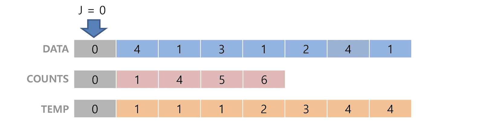

# 계수 정렬(Counting Sort)

*2019.06.02*


## 계수 정렬

```text
X보다 작은 원소의 개수가 N개일 때, X는 N+1번째에 위치할 것이다.
```

- 항목들의 순서를 결정하기 위해 각 항목이 몇 개씩 있는지 세는 작업을 하여, 선형 시간에 정렬하는 효율적인 알고리즘(특정 숫자들의 출현 빈도를 저장한 뒤, 누적분포를 이용하여 정렬하는 방식)
- 제한 사항 : 
  - 정수나 정수로 표현할 수 있는 자료에 대해서만 가능하다. 각 항목의 발생 횟수를 기록하기 위해, 정수 항목으로 인덱스 되는 카운트들의 배열의 사용하기 때문이다.
  - 카운트를 위한 충분한 공간을 할당하려면 집합 내의 가장 큰 정수를 알아야 한다.
- 시간복잡도 : O(n+k)
  - n(리스트의 길이)+k(최대 정수 값)
- 단점 : 
  - k값이 n보다 클 경우, 복잡도가 증가한다. 
  - k값이 커짐에 따라 공간복잡도가 증가한다.


### 1. [0, 4, 1, 3, 1, 2] 계수정렬 과정

**1단계** 

각 항목들의 발생 횟수를 세어 counts 배열에 저장한다.


**2단계** 

counts 원소를 누적합으로 조정한다.


**3단계** 

1. 원본 배열 Data의 원소를 인덱스로하는 counts 배열의 값을 감소 시킨다.(배열의 시작 인덱스는 0이므로 감소부터 수행)
2. counts 배열의 값이 temp배열의 인덱스가 되어 해당 위치의 data를 삽입한다.
3. (3단계)를 반복한다.


   					...




### 2. 계수 정렬

```python
# k : 최대 정수 값
def countingSort(data, temp, k) :
    counts = [0]*k
    
    for n in data :
        counts[n] += 1
    for i in range(1, k) :
        counts[i] += counts[i-1]
    for j in range(len(data)-1,-1,-1) :
        counts[data[j]] -= 1
        temp[counts[data[j]] = data[j]
```