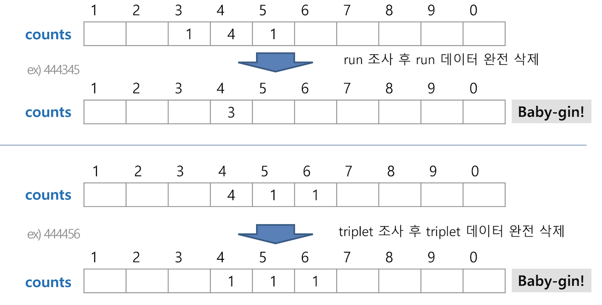

# 탐욕법(Greedy)

*2019.06.01*

## 탐욕 알고리즘

- 탐욕 알고리즘은 최적해를 구하는데 사용된다. 

- 여러 경우 중 하나를 결정해야 할 때마다 **그 순간에 최적이라고 생각되는 것을 선택**해 나가는 방식이다.

- 단, 각 선택의 시점에서 결정은 지역적으로는 최적일지라도 그 선택들을 최종적으로 수집하여 최종해를 만들었다고 하여, 그것이 **최적이라는 보장은 없다.**

  

### 1. 거스름돈 줄이기 문제

> 어떻게 하면 손님에게 거스름돈으로 주는 지폐와 동전의 개수를 최소화 할 수 있을까?

1. 해 선택
   - 가장 좋은 해를 선택한다. 단위가 큰 지폐와 동전으로만 거스름돈을 만든다. 현재 고를 수 있는 가장 큰 단위의 동전을 골라 거스름돈에 추가한다.
2. 실행 가능성 검사
   - 거스름돈이 실제 거스름돈을 초과하는지를 확인한다.
   - 초과 : 마지막에 추가한 동전을 거스름 돈에서 빼고 (1)로 돌아가서 현재보다 한 단계 작은 단위의 동전을 추가한다.
3. 해 검사
   - 거스름돈의 집합은 실제 거스름돈과 금액이 같아야한다. 만약 거스름돈이 일치하지 않는다면, 다시 (1)로 돌아간다.

#### 2. 그리디로 Baby-gin 문제 풀기

이전에는 `완전검색`으로 풀었다면, 이번에는 `그리디`로 풀어보자. 

- 카드의 숫자를 조사한 후, 각 run과 triplet을 조사한다.

