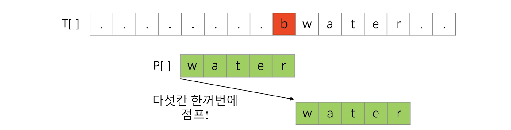

# 문자열 패턴 매칭

*2019.06.05*


## 1. Brute Force

- 본문 문자열을 처음부터 끝까지 차례로 순회하면서 문자열들을 일일이 비교하는 방식
- 시간복잡도 : O(nm)
  - 최악의 경우 : 타겟의 길이(n)*패턴의 길이(m)


### 1-1.  for문 이용

```python
# target에서 pattern 문자열 찾기
def bruteForce(target, pattern) :
    N = len(target)
    M = len(pattern)
  
    for n in range(N) :
        for m in range(M) :
            if target[n] != pattern[m] :
                break
            else :
                n += 1
        if m == M-1 :
            return "성공"
    return "실패"
```


### 1-2. while문 이용

```python
def bruteForce(target, pattern) :
    i, j = 0, 0
    next = i	# 불일치 발생시, 다음 i의 위치
    
    while i < len(target) and j < len(pattern) :
        if target[i] != pattern[j] :
            next += 1
            i = next
            j = 0
        else :
            i += 1
            j += 1
    if j == len(pattern) :
        return "성공"
    return "실패"
```


## 2. KMP 알고리즘🤟

- 불일치가 발생한 텍스트 스트링의 앞 부분에 어떤 문자가 있는지를 미리 알 수 있으므로, 불일치가 일어난 앞 부분에 대하여 다시 비교하지 않고 매칭을 수행한다.

- 패턴을 전처리하여 배열 next[m]을 구하여 잘못된 시작을 최소화 한다.
  - next[m] : 불일치가 발생했을 경우, 이동할 다음 위치

- 시간복잡도 : O(n+m)


### 2-1. KMP 과정

#### (1) 문자열 패턴 "ABAABAB" 의 다음 위치 계산

[KMP 알고리즘 설명 참고](https://bowbowbow.tistory.com/6)

- pi[i] : 0~i까지의 문자열에서 **접두어 = 접어어** 될 수 있는 부분문자열 중에서 가장 긴 것의 길이
- next[i] : 이동할 거리 = **i+1(접두부 일치 길이) - pi[i]**

|  i   | 접두부 길이 |부분 문자열 | pi[i] | next[i] |
| :--: | :--:  |:--:  |:--: |:--: |
| 0 | 1 | A | 0 |1|
| 1 | 2 | AB | 0 |2|
| 2 | 3 | **A**B**A** | 1 |2|
| 3 | 4 | **A**BA**A** | 1 |3|
| 4 | 5 | **AB**A**AB** | 2 |3|
| 5 | 6 | **ABA** **ABA** | 3 |3|
| 6 | 7 | **AB**AAB**AB** | 2 |5|

> 접미/접두어의 일치 길이가 짧을 수록 이동 거리가 늘어나므로 연산이 더 빠르다.


#### (2) 불일치 발생시, next[i]만큼 문자열 이동


### 2-2. KMP 구현

```python
# 더 공부가 필요함
```


## 3. 보이어-무어🤟

- **오른쪽에서 왼쪽**으로 비교한다.
- 현재 대부분의 프로그램의 문자열 검색 방법으로 사용되고 있다.
- 타겟의 오른쪽 끝에 있는 문자가 불일치 하고 이 문자가 패턴 내에 존재하지 않는 경우, 패턴의 길이만큼 이동한다.



- 타겟의 오른쪽 끝에 있는 문자가 불일치 하고 이 문자가 패턴 내에 존재하는 경우, 패턴 내부의 일치하는 문자와 다시 비교한다.


### 3-1. 보이어-무어

**1 단계**

- 불일치가 발생하면 남은 패턴의 영역 중 일치하는 문자를 찾아 이동한다.

| g | c | t | t | <span style="color:red;">c</span> | **t** | **g** | **c** | t | a | c | c | t | t | t | t | g | c | g | c | g | c |

| c | <span style="color:blue;">c</span> | t | t | <span style="color:red;">t</span> | **t** | **g** | **c** | 


**2단계**

- 남은 패턴 중 일치하는 문자가 존재하지 않는다면, 그 문자 바로 뒤부터 다시 검색을 진행한다.

| g | c | t | t | c | t | g | c | t | <span style="color:red;">a</span> | **c** | c | t | t | t | t | g | c | g | c | g | c |

​				 | c | c | t | t | t | t | <span style="color:red;">g</span> | **c** | 


**3단계**
| g | c | t | t | c | t | g | c | t | a | **c** | **c** | **t** | **t** | **t** | **t** | **g** | **c** | g | c | g | c | 

​														   | **c** | **c** | **t** | **t** | **t** | **t** | **g** | **c** | 


### 3-2. 보이어-무어 구현

```python
def boyerMoore(t, p) :
    M = len(t)
    N = len(p)

    i = j = N-1
    while i < M :
        for k in range(N) :
            if t[i-k] != p[j-k] :
                # 같지 않다면, p[j-k] for문으로 앞을 수색하면서 t[i-k]와 같은 값이 있나 찾기
                break
            if k == N-1 :
                return str(i-k)+"에서 일차하는 문자열 찾음"

        findThis = t[i-k]
        for r in range(k+1, N) :
            if p[j-r] == findThis :
                # 일치하는 것이 있다면
                i += r-k
                break
        if r == N-1 :
            # 일치하는 것이 없다면, N만큼 이동
            i += N-k 
        j = N-1
    return "일치하지 않음"

# 실행
print(boyerMoore("gcttctgctaccttttgcgcgc","ccttttgc"))

# 결과
# 10에서 일차하는 문자열 찾음
```


