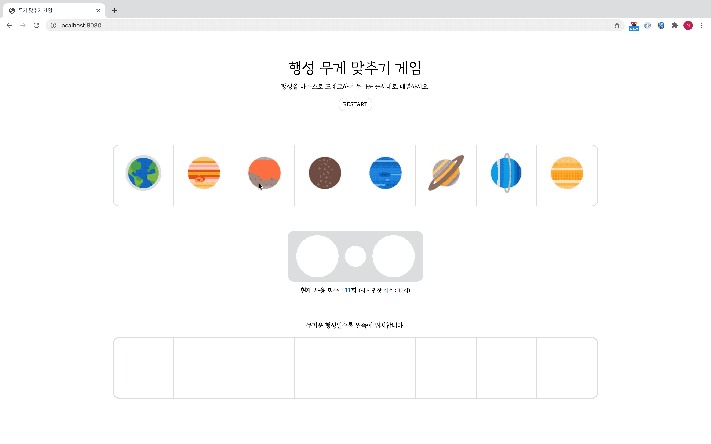

# 행성 무게 맞추기 게임

> AI 면접의 게임 중 하나인 '공무게 맞추기 게임'을 자바스크립트로 구현한 토이 프로젝트




### I. 목적

- 프레임워크를 사용하지 않고 자바스크립트로만 DOM 조작하기
- HTTPCollection과 NodeList의 차이를 이해하기
- DOM 이벤트 직접 조작하기


### II. 프로젝트 기능

1. 행성의 무게는 랜덤으로 정해지며, 게임이 끝날 때마다 갱신
2. 행성 이미지를 드래그 및 드롭 이벤트로 자유롭게 이동
3. HTTPCollection을 활용한 무게 비교 결과 출력
4. 모든 행성이 결과 박스에 들어오면 자동으로 게임 결과를 알리고 종료(별도의 종료버튼 없음)
5. 재시작 버튼 추가


### III. 실행

```shell
# http-server 설치
npm install -g http-server

# index.html이 존재하는 위치에서 실행
http-server ./
```


### IV. ETC

- 행성 이미지 출처 : https://icons8.com/icons/set/mercury-planet