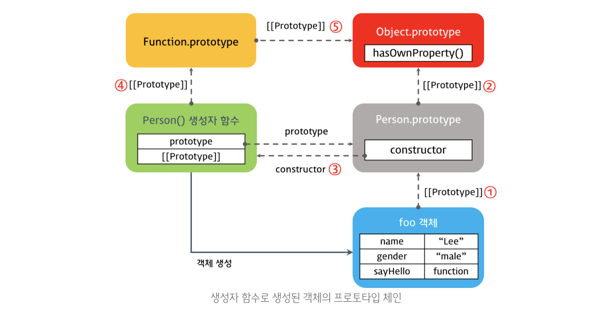

# 자바스크립트 기본2

🔗 [참고한 웹 사이트](https://poiemaweb.com/)


## I. 함수

> 함수란 어떤 작업을 수행하기 위해 필요한 문들의 집합이다. 

자바스크립트에서 함수는 일급 객체이므로 다른 변수와 동일하게 사용할 수 있다. 변수나 객체, 배열 등에 저장할 수 있고 다른 함수에 전달되는 인수로도 사용이 가능하며, 함수의 반환값으로도 사용할 수 있다.


### A. 함수 정의

1. **함수 선언문**

   ```javascript
   function square(number){
     return number*number
   }
   ```
	> 결국 함수 선언문은 자바스크립트 엔진에 의해 함수 표현식으로 다음과 같이 변경된다.
	>
	> ```javascript
	> // 기명함수 표현식으로 변환된다고 생각하면 됨
	> var square = function square(number){
	> return number*number
	> }
	> ```
	
2. **함수 표현식**

   - 일급 객체임을 이용하는 방법으로, 함수명을 생략한 것을 **익명 함수**라고 한다.

   ```javascript
   var square = function(number){
     return number*number
   }
   ```
	- 함수 할당 시 기명함수를 사용했더라도 그 함수를 사용하려면 기명함수 이름을 사용할 것이 아니라, 해당 함수의 주소를 가리키는 변수를 사용해서 함수를 호출해야한다. 그래서 익명함수를 사용하는 것임
	
	```javascript
	// 기명함수 사용
	var square = function multiply(number){
	  return number*number
	}
	console.log(square(3))	// 9
	console.log(multiply(3))	// Uncaught ReferenceError
	```
	- 함수는 객체이므로 주소를 복사한다.
	
	```javascript
	var square1 = function(number){
	  return number*number
	}
	// square1과 square2는 같은 익명 함수를 가리킨다.
	var square2 = square1
	console.log(square1 === square2)	// true
	```
	
3. function 생성자 함수

   - 일반적으로 사용하지 않음

   ```javascript
   var square = new Function('number', 'return number * number');
   console.log(square(10)); // 100
   ```

   

### B. 함수 호이스팅💡

> **자바스크립트는 모든 선언(var, let, const, function, class)을 호이스팅(Hoisting)한다.** 함수도 변수와 마찬가지로 선언시 호이스팅되는데, 함수 생성 방법에 따라 다르게 나타난다.

1. 함수 선언문

   - 함수 호이스팅이 일어나 함수 선언문이 해당 scope의 최상단으로 이동하므로 **함수의 선언 위치와 관계없이 소스 내 어디에서나 함수 호출이 가능**하다.

   ```javascript
   console.log(square(10)) // 100
   function square(number){
     return number*number
   }
   ```

2. 함수 표현식

   - 변수 호이스팅이 일어난다!
   - 즉, 함수가 해당 변수에 할당되기 전에 해당 변수에는 undefined가 할당되어 있다.

   ```javascript
   console.log(square)	// undefined
   console.log(square(10))	// square is not a function
   
   var square = function(number){
     return number*number
   }
   
   console.log(square(10))	// 100
   ```

   

### C. 함수의 Call-by-value, Call-by-reference

함수의 호출에서도 원시 타입 인자(Call-by-value)와 객체 타입 인자(Call-by-reference)는 각각의 레퍼런스를 따른다.

```javascript
function changeVal(primitive, obj){
  primitive += 100
  obj.name = "nana"
}

var primitive = 1
var obj = {name: "haha"}
changeVal(primitive, obj)

// 원시타입은 값에 의해 전달(복사하여 새로 생성)되므로 원본을 변경하지 않는다.
console.log(primitive)	// 1
// 객체타입은 주소에 의해 전달되므로 동일한 위치에 있는 값을 변경한다. 즉 원본이 변경된다.
console.log(obj) 	// {name: "nana"}
```


### D. 함수 객체의 프로퍼티

- 함수는 객체이므로 함수도 프로퍼티를 가질 수 있다.
- 함수는 일반 객체와는 다른 함수만의 프로퍼티를 갖는다.
- `arguments`, `caller`, `length`,` name`, `prototype`, `__proto__`


#### 1) arguments 프로퍼티

- arguments 객체는 함수 호출 시 전달된 인수들의 정보를 담고 있는 순회가능한 유사 배열 객체이다. 
- 함수 내부에서 지역 변수처럼 사용되며, 함수 외부에서 사용이 불가능하다.
- arguments 프로퍼티 덕분에 자바스크립트에서 함수 선언시 작성한 **매개변수보다 인수를 많거나 적게 전달해도 에러가 발생하지 않는다.**
- arguments 객체는 배열의 형태를 띄고 있지만 배열이 아닌 **유사배열**이다. 그래서 배열 메소드를 사용하는 경우 에러가 발생한다.
  - 유사배열객테는 length 프로퍼티를 가진 객체이다.

```javascript
function printArguments(x, y) {
  console.log(arguments);
}
printArguments()        // [callee: ƒ, Symbol(Symbol.iterator): ƒ]
printArguments(1)       // [1, callee: ƒ, Symbol(Symbol.iterator): ƒ]
printArguments(1, 2)    // [1, 2, callee: ƒ, Symbol(Symbol.iterator): ƒ]
```

> 그래서 arguments 객체는 매개변수 개수가 정해지지 않은 **가변 인자 함수**를 구현할 때 유용하게 사용된다.
>
> ```javascript
> function sum(){
>   var res = 0
>   for (var i = 0; i < arguments.length; i++) {
>     res += arguments[i];
>   }
>   return res
> }
> console.log(sum())					// 0
> console.log(sum(5, 10))			// 15
> console.log(sum(5, 10, 15))	// 30	
> ```


#### 2) length 프로퍼티

함수를 정의할 때 작성한 매개변수 개수

> arguments.length는 함수 호출시 들어온 인자의 개수

> length 프로퍼티는 함수 정의시 작성한 매개변수의 개수

```javascript
function sayLength(a,b){
  console.log(arguments.length)
}
console.log(sayLength.length)	// 2
sayLength(5, 10, 15)	// 3
```


#### 3) caller 프로퍼티

자신을 호출한 함수를 의미하며, 일반적으로 브라우저 상에서 바로 함수를 호출한 경우에는 null을 반환


#### 4) name 프로퍼티

함수명을 나타낸다. 기명함수의 경우 함수명을 갖고 익명함수는 빈문자열을 가진다.

```javascript
// 기명 함수 표현식
var namedFunc = function multiply(a, b) {
  return a * b;
};
// 익명 함수 표현식
var anonymousFunc = function(a, b) {
  return a * b;
};
console.log(namedFunc.name);     // multiply
console.log(anonymousFunc.name);	// ''
```


#### 5) \_\_proto\_\_ 접근자 프로퍼티💡

모든 객체에는 \_\_proto\_\_ 이라는 내부 슬롯이 있다. _\_proto\_\_ 은 프로토타입 객체를 가리킨다.

프로토타입 객체란 객체의 상속을 구현하기 위해 사용괸다.

**\_\_proto\_\_  프로퍼티는 [[prototype]] 내부 슬롯이 가리키는 프로토타입 객체(부모)에 접근하기 위해 사용되는 접근자 프로퍼티이다.** \_\_proto\_\_ 내부 슬롯에는 직접 접근이 불가능하며, \_\_proto\_\_ 프로퍼티를 이용해 접근한다.

```javascript
// [1] __proto__ 접근자 프로퍼티를 통해 자신의 프로토타입 객체에 접근할 수 있다.
// [2] 모든 객체는 Object.prototype의 접근자 프로퍼티 __proto__를 상속받아 사용하는 것이다.
// {}의 프로토타입 객체(부모)는 Object.prototype 이다.
console.log({}.__proto__ === Object.prototype)	// true

```

```javascript
// [3] 함수 객체의 프로토타입 객체는 Function.prototype이다.
console.log((function() {}).__proto__ === Function.prototype) // true
```


#### 6) prototype 프로퍼티💡

**prototype 프로퍼티는 함수 객체만이 소유하는 프로퍼티**로 일반 객체는 이를 가지고 있지 않다.

prototype 프로퍼티는 함수가 객체를 생성하는 생성자 함수로 사용될 때, **생성자 함수가 생성한 인스턴스의 프로토타입 객체**를 가리킨다.

```javascript
function User(name, age){
  this.name = name
  this.age = age
}
console.log(user.__proto__ === Function.prototype)	// true


var user1 = new User("nana", 27)
console.log(user1.__proto__ === Function.prototype)	// false
console.log(user1.__proto__ === User.prototype)	// true
```


### E. 함수의 다양한 형태

#### 1) 즉시 실행 함수

함수의 정의와 동시에 실행되는 함수로 최초 한번만 실행되고 다시 호출할 수 없다. 그래서 초기 한번만 실행되어야하는 초기화 처리 등에 사용할 수 있다.

```javascript
(function initalFunc(){
  return 200
}())

(function initalFunc(){
  return 200
})()
```


#### 2) 내부 함수

함수 내부에 정의된 함수를 내부함수라고 한다.

내부함수는 자신을 포함하고 있는 부모함수의 변수에 접근이 가능하다. 하지만 부모함수는 내부함수의 변수에 접근할 수 없다.

내부함수는 부모함수의 외부에서 접근할 수 없다.

```javascript
function parent(){
  var child = function(){
    console.log("child is here")
  }
  child()
}

parent()	// child is here
child()	// child is not defined
```


#### 3) 재귀 함수

재귀 함수는 반복 연산을 간단히 구현할 수 있다는 장점이 있지만 무한 반복에 빠질 수 있고, stackoverflow 에러를 발생시킬 수 있으므로 주의하여야 한다.


#### 4) 콜백 함수💡

함수를 명시적으로 호출하는 방식이 아니라 **특정 이벤트가 발생했을 때 시스템에 의해 호출되는 함수**를 말한다. 

- DOM 객체의 이벤트 핸들러 등이 여기에 해당한다.
- 콜백 함수는 주로 비동기식 처리 모델에 사용된다. 비동기식 처리 모델이란 처리가 종료되면 호출될 함수(콜백 함수)를 미리 매개변수에 전달하고 처리가 종료되면 콜백함수를 호출하는 것이다.
- 콜백함수는 콜백 큐에 들어가 있다사 해당 이벤트가 발생하면 호출된다. 콜백함수는 **클로저**이므로 콜백 큐에 단독으로 존재하다가 호출되어도 콜백함수를 전달받은 함수의 변수에 접근할 수 있다.

```javascript
function doSomething(){
  var name = "nana"
  
  // setTimeout에 골백함수 등록
  setTimeout(function () {
    console.log("My name is " + name);
  }, 1000);
  console.log("I'm " + name);
}
doSomething()
/*
I'm nana
My name is nana
*/
```


## II. 프로토타입(Prototype)

> 클래스 기반의 다른 객체 지향 언어와 달리, 자바스크립트는 프로토타입 기반 객체 지향 언어이다. 따라서 자바스크립트의 동작 원리를 이해하기 위해서는 프로토타입의 개념을 잘 이해해야 한다.

자바스크립트의 모든 객체는 자신의 부모 역할을 하는 객체와 연결되어 있다. 그리고 이것은 객체지향의 상속처럼 부모 객체의 프로퍼티 또는 메소드를 상속받아 사용할 수 있게 한다. 이러한 부모 객체를 `프로토타입(Prototype)`이라고 한다.

```javascript
var student = {
  name: 'Lee',
  score: 90
}
console.log(student.__proto__ === Object.prototype); // true
```

객체를 생성할 때 프로토타입이 결정되며, 결정된 프로토타입을 임의의 객체로 변경하는 것도 가능하다. 즉, 부모 객체의 프로토타입일 동적으로 변경할 수 있다는 말이다.


###  A. \_\_proto\_\_ vs prototype 프로퍼티💡

`__proto__` 와 `prototype 프로퍼티` 모두 프로토타입 객체를 가리키지만 엄연히 구분된다.


#### 1) _\_proto\_\_ 

- 함수를 포람한 모든 객체가 가지고 있는 인터널 슬롯이다.
- 객체의 입장에서 **자신의 부모 역할을 하는 프로토타입 객체**를 가리킨다. 
  - 객체의 경우 Object.prototype
  - 함수의 경우 Function.prototype

```javascript
function User(name){
  this.name = name
}
console.log(user.__proto__ === Function.prototype)	// true
```


#### 2) prototype

- 함수 객체만 가지고 있는 프로퍼티

  ```javascript
  function User(name){
    this.name = name
  }
  var user1 = new User("nana")
  
  console.dir(User)	// prototype 프로퍼티가 있다.
  console.dir(user1)	// prototype 프로퍼티가 없다.
  ```

- 함수가 생성자로 사용될 때, 이 함수를 통해 생성된 자식 객체가 가리키는 부모 객체(프로토타입 객체)가 된다.

```javascript
function User(name){
  this.name = name
}

var user1 = new User("nana")
console.log(user1.__proto__ === User.prototype)	// true
```


### B. constructor 프로퍼티

프로토타입 객체는 constructor 프로퍼티를 갖는다. constructor 프로퍼티는 객체의 입장에서 자신을 생성한 객체를 가리킨다.

```javascript
function Person(name){
  this.name = name
}
/*
[1] 
Person() 생성자 함수에 의해 생성된 함수들의 프로토타입 객체는 Person.prototype 이며, 해당 프로토타입 객체를 가지는 객체들의 생성자는 당연히 Person() 생성자이다.
*/
console.log(Person.prototype.constructor)		// Person

var user = new Person("nana")

// [2] user객체를 생성한 생성자는?
console.log(user.constructor)		// Person

// [3] Person 생성자 함수의 생성자는?
console.log(Person.constructor) 	// Function
```


### C. Prototype chain

특정 객체의 프로퍼티나 메소드를 호출할 때, 해당 객체에 존재하지 않는 프로퍼티나 메소드에 접근하면 \_\_proto\_\_이 가리키는 프로포타입 객체의 프로퍼티나 메소드를 차례로 검색하는데, 이를 **프로토타입 체인**이라고 한다.

- user 객체에 존재하지 않는 메소드 hasOwnProperty를 호출했지만 잘 실행됨

```javascript
var user = {
  name: "nana"
}
// Object.prototype.hasOwnProperty()
console.log(user.hasOwnProperty('name'))	// true
```


### D. 객체 생성 방법에 따른 프로토타입 체인💡

> 코드 결과를 정확하게 이해할 것!

자바스크립트의 객체 생성 방식은 총 3가지가 있는데, 어떤 방식에 의해 생성됐는지에 따라 prototype 객체가 다르다.

| 객체 생성 방식   | 자바스립트 엔진 | 인스턴스의 prototype 객체  |
| ---------------- | --------------- | -------------------------- |
| 객체 리터럴 : {} | Object() 생성자 | Object.prototype           |
| Object() 생성자  | Object() 생성자 | Object.prototype           |
| 생성자 함수      | 생성자 함수     | 생성자 함수 이름.prototype |

```javascript
function Person(name){
  // Person함수와 별개로 Person.prototype 객체가 생성된다.
  this.name = name
}
var foo = new Person("nana")

console.log(foo.__proto__) 	// Person.prototype
console.log(Person.prototype.__proto__)	// Object.prototype
console.log(Person.prototype.constructor)	// Person - 생성자 가리킴  
console.log(Person.__proto__)	// Function.prototype
console.log(Function.prototype.__proto__)	// Object.prototype
```




### E. 프로토타입 객체의 확장

프로토타입 객체에도 일반 객체와 마찬가지로 프로퍼티를 추가/삭제할 수 있다. 그리고 추가/삭제된 프로퍼티는 즉시 프로퍼티 체인에 반영된다.

```javascript
function Person(name){
  this.name = name
}
var foo = new Person("nana")
var bar = new Person("haha")

// [문제] 자신의 이름을 출력하는 메소드를 작성하시오!
Person.prototype.sayName = function(){
  console.log(this.name)
}

foo.sayName()	// nana
bar.sayName()	// haha
```


### F. 원시 타입 객체의 확장

원시타입은 객체가 아니므로 프로퍼티나 메소드를 직접 추가할 수 없지만, 원시 타입의 프로퍼티 객체에 메소드나 프로퍼티 추가는 가능하다.

```javascript
String.prototype.myMethod = function(){return "사용자 정의 메소드"}
s
var str = "test"
console.log(str.myMethod())	// 사용자 정의 메소드
console.log("".myMethod())	// 사용자 정의 메소드
```

> 자바스크립트의 기본 데이터 타입에서 사용하는 메소드들은 prototype에 정의되어 있음을 알 수 있다.


### G. 프로토타입 체인과 프로퍼티 동적 할당

```javascript
function Person(name){
  this.name = name
}
Person.prototype.gender = "female"

var foo = new Person("nana")
console.log(foo)	//{name: "nana"}
console.log(Person.prototype)	// {gender: "female", constructor: ƒ}

// foo에 gender 프로퍼티 동적 할당
foo.gender = "male"
console.log(foo)	//{name: "nana", gender: "male"}
console.log(foo.gender)	// male

// Person.prototype.gender에는 변화 없다.
console.log(Person.prototype.gender)	// female
```


