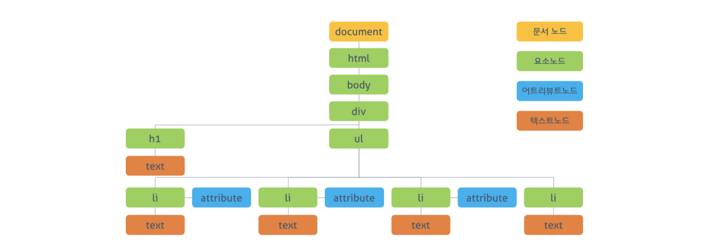

## Document Object Model

> 문서 객체 모델(Document Object Model)

텍스트 파일로 만들어진 웹 문서를 브라우저에 렌더링하려면 웹 문서를 브라우저가 이해할 수 있는 구조로 메모리에 올려야 한다.

브라우저 엔진은 웹 문서를 로드한 후, 파싱하여 웹 문서를 브라우저가 이해할 수 있는 구조로 구성하여 메모리에 적재하는데 이를 `DOM`이라고 한다. 즉, **모든 요소와 요소의 어트리뷰트, 텍스트를 각각의 객체로 만들고 이들 객체를 부자 관계를 표현할 수 있는 트리 구조로 구성한 것이 DOM이다.** 

이 DOM은 자바스크립트를 통해 동적으로 변경할 수 있으며, 변경된 DOM은 렌더링에 반영된다. 이러한 동적 변경을 위해 **DOM은 프로그래밍 언어가 자신에게 접근하고 수정할 수 있는 방법을 제공**하는데 일반적으로 프로퍼티와 메소드를 갖는 자바스크립트 객체로 제공된다. 이를 `DOM API`라고 부른다.

*즉, 정적인 웹페이지에 접근하여 동적으로 웹페이지를 변경하기 위한 유일한 방법은 메모리상에 존재하는 DOM을 변경하는 것이고, 이때 필요한 것이 DOM에 접근하고 변경할 수 있는 DOM API이다.*


## I. DOM tree

DOM Tree는 브라우저가 HTML문서를 로드한 후 파싱하여 새성하는 모델을 의미한다. 객체의 트리로 구조화되어 있어 DOM tree라고 부른다.



DOM에서 모든 요소, 어트리뷰트, 텍스트는 하나의 객체이며 Document 객체의 자식이다. DOM tree의 루트는 document 객체이며 최종점은 요소의 텍스트를 나타내는 객체이다.

DOM tree는 네 종류의 노드로 구성된다.

1. `Document Node`

   - 트리의 최상단 노드로 각각 요소, 어트리뷰트, 텍스트 노드에 접근하려면 `Document Node`를 통해야 한다.

2. Element Node

   - HTML 요소를 표현한다. 또한, `Element Node`는 문서의 구조를 서술한다고 말 할 수 있다. 

3. Attribute Node

   - HTML 요소의 속성을 표현한다. 또한, `Attribute Node`는  지정된 요소의 자식이 아니라 해당 요소의 일부로 표현된다.
   - 즉, `Element Node`를 찾아 접근하면 `Attribute Node`를 참조, 수정할 수 있다.

4. Text Node

   - HTML 요소의 텍스트를 표현한다. `Text Node`는 `Element Node`의 마지막 자식이며, 자신의 자식 노드를 가질 수 없다. 

   

## II. DOM API

DOM을 통해 웹페이지를 조작(manipulate)하기 위해서는 두 가지 수순이 필요하다.

1. 조작하고 싶은 요소를 선택하고 탐색
2. 선택된 요소의 콘텐츠 또는 어트리뷰트를 조작

자바스크립트는 이것에 대한 API를 제공한다.


### 1. DOM Query / Traversing (요소 접근)

```html
<!DOCTYPE html>
<html>
  <head>
    <style>
      .red  { color: #ff0000; }
    </style>
  </head>
  <body>
    <div>
      <h1>Cities</h1>
      <ul>
        <li id="one" class="red">Seoul</li>
        <li id="two" class="red">London</li>
        <li id="three" class="red">Newyork</li>
        <li id="four">Tokyo</li>
      </ul>
    </div>
  </body>
</html>
```


#### 1) 하나의 요소 노드 선택

`document.getElementById(id)`

- id로 요소 노드 한개 선택한다.
- 복수개가 선택된 경우, 첫번째 요소만 반환한다.

```javascript
const el = document.getElementById('one')
console.log(el)		// <li id="one" class="red">Seoul</li>

console.log(el.__proto__)	// HTMLLIElement
console.log(el.__proto__.__proto__) // HTMLLIElement
console.log(el.__proto__.__proto__.__proto__) // Element
console.log(el.__proto__.__proto__.__proto__.__proto__)	// Node
```


`document.querySelector(cssSelector)`

- css 셀렉터를 이용하여 요소 노드를 한개 선택한다. 
- 복수개가 선택된 경우, 첫번째 요소만 반환한다.

```javascript
const el = document.querySelector('li.red')
console.log(el)		// <li id="one" class="red">Seoul</li>
```


#### 2) 여러 개의 요소 노드 선택

`document.getElementsByClassName(class)`

- class 어트리뷰트 값으로 요소 노드를 모두 선택한다.
- class는 HTML 내에서 여러 노드에 사용될 수 있으므로 여러개의 노드가 HTMLCollection인 유사 배열 형태로 반환된다.
- Return: HTMLCollection (live)

```javascript
const el = document.getElementsByClassName('red')
console.log(el)	// HTMLCollection
```

> HTMLCollection은 실시간으로 변경된다. 즉, HTMLCollection 내에 .red 요소가 저장되어 있을 때, 해당 요소에서 .red를 삭제하면 실시간으로 반영되어 HTMLCollection 내에서 제거된다.
>
> HTMLCollection을 배열로 만들면 더이상 live하지 않다.
>
> ```javascript
> const el = document.getElementsByClassName('red')
> console.log([...el])	// [li#one.red, li#two.red, li#three.red]
> ```


`document.getElementsByTagName(tagName)`

- 태그명으로 요소 노드를 모두 선택한다.
- Return: HTMLCollection (live)


`document.querySelectorAll(selector)`

- 저장된 css 선택자를 사용하여 요소 노드를 모두 선택한다.
- Return: NodeList (non-live) : 즉, 리턴된 값이 변하지 않는다.


### 2. DOM Traversing (탐색)

#### 1) 부모 노드 탐색

`parentNoe` 

- 부모 노드를 탐색한다.
- 부모는 하나뿐이므로 HTMLElement를 반환한다.

```javascript
var el = document.querySelector('#two')
console.log(el.parentNode)	// <ul>..</ul>
```


#### 2) 자식 노드 탐색

` firstChild`, `lastChild`

- 자식노드를 탐색한다.
- 생각보다 제대로 동작 안한다. 요소 사이의 공백 또는 줄바꿈 문자를 텍스트 노드로 취급하기 때문이다.
- 그래서 `firstElementChild`, `lastElementChild`를 사용할 수도 있다.


`hasChildNodes()`

- 자식노드가 있는지 확인하고 Boolean 값을 리턴한다.

`childNodes` 

- 텍스트 노드를 포함한 모든 자식 요소를 반환한다.
- Return: NodeList (non-live)

`children`

- 자식 노드 중에서 Element type 요소만을 반환한다
- Return: HTMLCollection(live)

```javascript
var el = document.querySelector('ul')

console.log(el.childNodes)
// NodeList(9) [text, li#one.red, text, li#two.red, text, li#three.red, text, li#four, text]

console.log(el.children)
// HTMLCollection(4) [li#one.red, li#two.red, li#three.red, li#four, one: li#one.red, two: li#two.red, three: li#three.red, four: li#four]
```


#### 3) 형제 노드 탐색

`previousSibling`, `nextSibling`

- 형제 노드 탐색, text node를 포함한 모든 형제 노드를 탐색한다.
- Return: HTMLElement

`previousElementSibling`, `nextElementSibling`

- 형제 노드중 중  Element type 요소만을 반환한다
- Return: HTMLElement


### 3. DOM Manipulation (조작)


#### 1) 텍스트 노드 접근/수정

- 요소의 텍스트는 텍스트 노드에 저장되어 있다. 텍스트 노드에 접근하려면 아래와 같은 수순이 필요하다.

  1. 해당 텍스트 노드의 부모 노드를 선택한다.(요소 노드)
  2. firstChild 프로퍼티를 사용하여 텍스트 노드를 탐색한다.
  3. 텍스트 노드의 유일한 프로퍼티(`nodeValue`)를 이용하여 텍스트를 취득한다.
  4. `nodeValue`를 이용하여 텍스트를 수정한다.

  

`nodeValue`

- 노드의 값을 반환한다.
- Return: 텍스트 노드의 경우는 문자열, 요소 노드의 경우 null 반환

```javascript
var el = document.getElementById('one')
console.log(el.firstChild.nodeValue)	// Seoul
```


#### 2) 어트리뷰트 노드에 접근

`className` 

- class 어트리뷰트의 값을 취득 또는 변경한다. 
- class는 여러개 지정이 가능하다. 따라서 만약 하나의 요소에 여러개의 class가 지정된 경우, class 어트리뷰트 값들이 공백으로 구분된 문자열로 반환된다. 그러므로 split(" ")을 사용하여 배열로 만들어 사용한다.

`classList`

- add, remove, item, toggle, contains, replace 메소드를 제공한다.
- 손쉽게 class 어트리뷰트 조작이 가능하다.


### 4. HTML 콘텐츠 조작(Manipulation)💡

`textContent`

- 요소의 텍스트 콘텐츠를 취득 또는 변경한다. 이때 마크업은 무시된다. 

```javascript
var ul = document.querySelector('ul');
console.log(ul.textContent)
/*
Seoul
London
Newyork
Tokyo
*/
```


`innerText`

- 요소의 텍스트 콘텐츠에만 접근이 가능하지만 아래의 이유 때문에 잘 사용하지 않음
  - 비표준이다.
  - CSS에 순종적이여서 텍스트를 추가한 요소의 CSS 속성이 display:hidden이라면 표시되지 않음
  - CSS를 고려하므로 느리다.


`innerHTML`

- 해당 요소의 모든 자식 요소를 포함하는 모든 콘텐츠를 하나의 문자열로 취득이 가능하다.
- 마크업을 포함하며, 마크업을 인지하므로 새로운 요소 삽입이 가능하다.

```javascript
var ul = document.querySelector('ul')
console.log(ul.innerHTML)
/*
<li id="one" class="red">Seoul</li>
<li id="two" class="red">London</li>
<li id="three" class="red">Newyork</li>
<li id="four">Tokyo</li>
*/
ul.innerHTML += "<li id='five'>LA</li>"
```

> 그러나 해당 경우에 XSS 공격에 취약하다는 단점이 존재한다.


### 5. DOM 조작 방식💡

`innerHTML`을 사용하지 않고 새로운 컨텐츠를 추가할 수 있는 방법은 DOM을 직접 조작하는 것이다.

1. 노드 생성 `createElement()` 메소드를 사용하여 새로운 요소 노드를 생성한다.
2. (생략가능) 텍스트 노드 생성 `createTextNode()`를 사용하여 새로운 텍스트 노드를 생서한다.
3. `appendChild()`를 사용하여 생성된 요소를 DOM tree에 추가한다. 또는 `removeChild() `메소드를 사용하여 DOM tree에서 노드를 삭제할 수도 있다.

```javascript
var el = document.querySelector('ul')

//[1] 노드 생성
const newEl = document.createElement('li')

//[2] 텍스트 노드 생성
const newText = document.createTextNode('Beijing')

//[3-1] 텍스트 노드를 요소 노드에 연결
newEl.appendChild(newText)

//[3-2] 요소 노드를 DOM tree에 추가
el.appendChild(newEl)

//[3-3] 요소 노드 제거
el.removeChild(newEl)
```


### 6. insertAdjacentHTML()

`insertAdjacentHTML(position, string)`

- 인자로 전달한 텍스트(string)를 HTML로 파싱하고 그 결과로 생성된 노드를 DOM 트리의 지정된 위치(position)에 삽입하는 API

- position 값은 아래와 같다.

  - 'beforebegin'
  - 'afterbegin'
  - 'beforeend'
  - 'afterend'

  ```html
  <!-- beforebegin -->
  <p>
    <!-- afterbegin -->
    foo
    <!-- beforeend -->
  </p>
  <!-- afterend -->
  ```

```javascript
var el = document.querySelector('ul')
el.insertAdjacentHTML('beforeend', '<li class="blue"> Korea</li>')
```


> innerHTML과 insertAdjacentHTML()은 크로스 스크립팅 공격(XSS: Cross-Site Scripting Attacks)에 취약하다. 따라서 untrusted data의 경우, 주의하여야 한다. 텍스트를 추가 또는 변경시에는 textContent, 새로운 요소의 추가 또는 삭제시에는 DOM 조작 방식을 사용하도록 한다.


### 7. style

- style 프로퍼티를 사용하면 inline 스타일 선언을 생성한다.

```javascript
var el = document.getElementById('three')
el.style.color = 'yellow'
```


