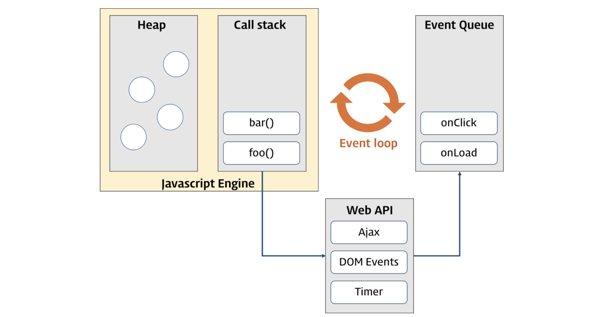
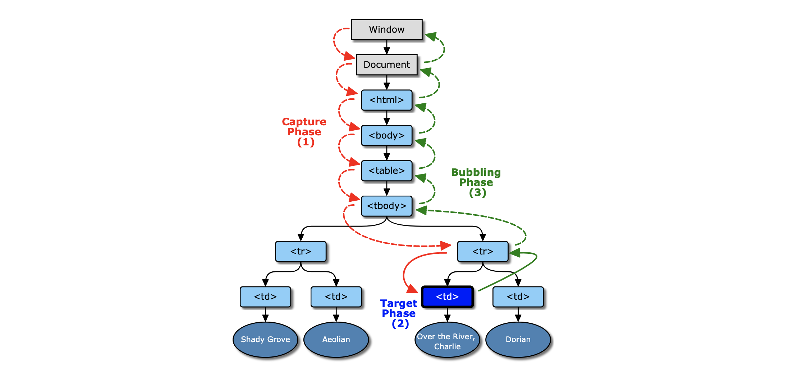

# 자바스크립트의 이벤트

> 자바스크립트의 대부분의 DOM 이벤트 핸들러와 Timer 함수(setTimeout, setInterval), Ajax 요청은 비동기식 처리 모델로 동작한다.


**브라우저에서의 이벤트란** 사용자가 버튼을 클릭하거나, 웹 페이지가 로드되었을 때와 같이 **DOM 요소와 관련**이 있다.

이벤트가 발생하는 시점이나 순서를 사전에 인지할 수 없으므로 일반적인 제어 흐름과는 다른 접근 방식이 필요하다. 즉, 이벤트가 발생하면 누군가 이를 감지할 수 있어야 하며 그에 대응하는 처리를 호출해 주어야 한다.

**브라우저는 이벤트를 감지할 수 있으며 이벤트 발생 시에는 통지해 준다. 이 과정을 통해 사용자와 웹페이지는 상호작용이 가능해진다.**


## I. 이벤트 루프(Event Loop)와 동시성(Concurrency)

브라우저는 단일 쓰레드(single-thread)에서 이벤트 드리븐(event-driven)방식으로 동작한다.

쓰레드가 하나뿐이므로 한번에 하나의 작업만 처리가 가능하다. 그러나 실제로 동작하는 웹사이트는 동시에 여러개의 일들이 진행되고 있는 것처럼 보인다. 이처럼 **자바스크립트의 동시성(Concurrency)을 지원하는 것이 바로 이벤트 루프(Event Loop)이다.**



`Call stack`

- 작업이 요청되면(함수 호출 시) 요청된 작업은 순차적으로 Call stack에 쌓이게 되고 순차적으로 실행된다. 
- 자바스크립트는 단 한개의 Call stack을 사용하기 때문에 해당 task가 종료하기 전까지는 다른 어떤 task도 수행될 수 없다.

`Heap`

- 동적으로 생성된 객체 인스턴스가 할당되는 영역


이와 같이 자바스크립트 엔진은 단순이 작업이 요청되면 `Call stack`을 사용하여 요청된 작업을 순차적으로 실행한다. 앞서 언급된 동시성을 지원하기 위한 비동기 처리는 자바스크립트 엔진을 구동하는 브라우저가 담당한다.


`Event Queue(Task Queue)`

- 비동기 처리 함수의 콜백 함수, 비동기식 이벤트 핸들러, Timer 함수(setTimeout(), setInterval())의 콜백 함수가 보관되는 영역으로 이벤트 루프에 의해 특정 시점(`Call stack`이 비어졌을 때)에 순차적으로 `Call stack`으로 이동되어 실행된다.

`Event Loop(이벤트 루프)`

- `Call stack` 내에 현재 실행중인 작업이 있는지, `Event Queue`에도 작업이 있는지 반복하여 확인한다.
- 만약, `Call stack` 이 비어 있다면 `Event Queue`의 작업을 `Call stack` 으로 이동시키고 실행한다.


#### 코드로 이해하자!

```javascript
function func1() {
  console.log('func1');
  func2();	
}

function func2() {
  setTimeout(function () {
    console.log('func2');
  }, 0);

  func3();
}

function func3() {
  console.log('func3');
}

func1();
/*
func1
func3
func2
*/
```

1. `call stack` func1()가 쌓인다.
   - **console.log('func1') 실행**
2. `call stack` func2()가 쌓인다.
3. func2()의 setTimeout()함수의 콜백함수는 즉시 실행되지 않고 지정된 대기 시간만큼 기다려야 한다.
   - 특정 시간이 종료된 뒤, setTimeout()함수의 콜백함수는 `Event Queue(Task Queue)`에 쌓인다.
4. `call stack` func3()가 쌓인다.
   - **console.log('func3') 실행**
5. `call stack` 에서 실행의 역순으로 함수가 종료되고 `call stack`을 빠져나온다.
6. `call stack`이 비어져있으면, `Event Queue(Task Queue)`에서 콜백함수를 하나씩 빼서 `call stack` 에 넣고 실행한다.
   - **console.log('func2') 실행**


> 💡이벤트 핸들러도 같은 방법으로 동작한다. 즉, 이벤트가 발생하면 해당 콜백함수가  `Event Queue(Task Queue)`에 저장되고 `call stack` 가 비어있을 때, `call stack` 로 이동되어 실행된다.

> [이벤트 종류는 클릭!](https://developer.mozilla.org/en-US/docs/Web/Events)


## II.  이벤트 핸들러 등록

이벤트가 발생했을 때 동작할 이벤트 핸들러를 이벤트에 등록하는 방법은 3가지이다.

> 이벤트 핸들러 프로퍼티 : `on`, `onclick`, `keyup` 등


### 1. 인라인 이벤트 핸들러 방식

html 객체 요소에 이벤트 핸들러를 직접 등록하는 방식

```html
<!DOCTYPE html>
<html>
<body>
  <button onclick="myHandler()">Click me</button>
  <script>
    function myHandler() {
      alert('Button clicked!');
    }
  </script>
</body>
</html>
```

- 한번에 여러 개의 함수를 전달할 수 있다.

  ```html
  <!DOCTYPE html>
  <html>
  <body>
    <button onclick="myHandler1(); myHandler2();">Click me</button>
    <script>
      function myHandler1() {
        alert('myHandler1');
      }
      function myHandler2() {
        alert('myHandler2');
      }
    </script>
  </body>
  </html>
  ```

- 실제로는 아래처럼 변경된다.

  ```javascript
  // <button onclick="myHandler1(); myHandler2();">Click me</button>
  onclick = function(event){
    myHandler1()
    myHandler2()
  }
  ```


### 2. 이벤트 핸들러 프로퍼티 방식

인라인 이벤트 핸들러 방식처럼 HTML과 Javascript가 뒤섞이는 문제는 해결할 수 있는 방식이다. 하지만 **이벤트 핸들러 프로퍼티에 하나의 이벤트 핸들러만을 바인딩할 수 있다는 단점**이 있다.

```html
<!DOCTYPE html>
<html>
<body>
  <button class="btn">Click me</button>
  <script>
    const btn = document.querySelector('.btn');

    // 이벤트 핸들러 프로퍼티 방식은 이벤트에 하나의 이벤트 핸들러만을 바인딩할 수 있다
    // 첫번째 바인딩된 이벤트 핸들러 => 실행되지 않는다!!!!
    btn.onclick = function () {
      alert('①');
    };

    // 두번째 바인딩된 이벤트 핸들러
    btn.onclick = function () {
      alert('②');
    };

  </script>
</body>
</html>
<!-- 
②
-->
```


### 3. addEventListener 메소드 방식💡

`addEventListener` 메소드를 이용하여 대상 DOM 요소에 이벤트를 바인딩하고 해당 이벤트가 발생했을 때 실행될 콜백 함수(이벤트 핸들러)를 지정한다.

- **하나의 이벤트에 여러 개의 이벤트 핸들러를 추가**할 수 있다.
- **캡처링과 버블링을 지원한다.**
- HTML뿐만 아니라 모든 DOM 요소에 대해 동작한다.

```html
<!DOCTYPE html>
<html>
<body>
  <button class="btn">Click me</button>
  <script>
    const btn = document.querySelector('.btn');

    // 첫번째 바인딩된 이벤트 핸들러
    btn.addEventListener('click', function () {
      alert('①');
    })
    
    // 두번째 바인딩된 이벤트 핸들러
    btn.addEventListener('click', function () {
      alert('②');
    })
  </script>
</body>
</html>
<!-- 
①
②
-->
```

>  `addEventListener` 는 이벤트 전파를 읽을 수 있다. 세번째 인자를 true로 설정하면 캡처링으로 전파되는 이벤트를 캐치하고 false(default)로 설정하면 버블링 전파 이벤트를 읽는다.


## III. 이벤트의 흐름💡

계층적 구조에 포함되어 있는 HTML 요소에 이벤트가 발생하면 연쇄적 반응이 일어난다. 즉, 이벤트가 전파(Event Propagation)되는데 전파 방향에 따라 `버블링(Event Bubbling)`과 `캡처링(Event Capturing)`으로 구분할 수 있다.

1. `버블링(Event Bubbling)` : 자식요소 => 부모요소

2. `캡처링(Event Capturing)` : 부모요소 => 자식요소

    

*주의할 점은 버블링과 캡처링은 둘 중 하나만 일어나는 것이 아니라, **캡처링부터 시작해서 버블링으로 종료**된다. 즉, 이벤트가 발생했을 때 캡처링과 버블링은 순차적으로 발생한다.*




### 1. 이벤트 버블링

자식요소에서 부모요소로 이벤트가 전파되는 것

```html
<!DOCTYPE html>
<html>
<head>
  <style>
    html, body { height: 100%; }
  </style>
<body>
  <p>버블링 이벤트 
    <button>버튼</button>
  </p>
  <script>
    const body = document.querySelector('body');
    const p = document.querySelector('p');
    const button = document.querySelector('button');
    
    // body 태그로 버블링 되는 것을 탐지한다.
    body.addEventListener('click',function(){
      console.log('body')
    })
    // p 태그로 버블링 되는 것을 탐지한다.
		p.addEventListener('click',function(){
      console.log('p')
    })
    // button 태그로 버블링 되는 것을 탐지한다.
		button.addEventListener('click',function(){
      console.log('button')
    })
  </script>
</body>
</html>
<!-- 
[1] button 클릭
button
p
body

[2] p 클릭
p
body

[3] body 클릭
body
-->
```


### 2. 이벤트 캡처링

부모에서 자식으로 이벤트가 전파되는 것

```html
<!DOCTYPE html>
<html>
<head>
  <style>
    html, body { height: 100%; }
  </style>
<body>
  <p>버블링 이벤트 
    <button>버튼</button>
  </p>
  <script>
    const body = document.querySelector('body');
    const p = document.querySelector('p');
    const button = document.querySelector('button');
    
    // body 태그로 캡처링 되는 것을 탐지한다.
    body.addEventListener('click',function(){
      console.log('body')
    }, true)
    // p 태그로 캡처링 되는 것을 탐지한다.
		p.addEventListener('click',function(){
      console.log('p')
    }, true)
    // button 태그로 캡처링 되는 것을 탐지한다.
		button.addEventListener('click',function(){
      console.log('button')
    }, true)
  </script>
</body>
</html>
<!-- 
[1] button 클릭
button

[2] p 클릭
p
button

[3] body 클릭
body
p
button
-->
```


>**버블링과 캡처링이 혼용되는 경우**
>
>항상 부모요소의 캡처링 => 자식요소의 버블링 전파 순으로 진행된다.
>
>```html
><!DOCTYPE html>
><html>
><head>
><style>
>html, body { height: 100%; }
></style>
><body>
><p>버블링 이벤트 
><button>버튼</button>
></p>
><script>
>const body = document.querySelector('body');
>const p = document.querySelector('p');
>const button = document.querySelector('button');
>
>		// 버블링
>body.addEventListener('click',function(){
> console.log('body 버블링')
>})
>
>// 캡처링
>		p.addEventListener('click',function(){
> console.log('p 캡처링')
>}, true)
>
>// 버블링
>		button.addEventListener('click',function(){
> console.log('button 버블링')
>})
></script>
></body>
></html>
><!-- 
>[1] button 클릭
>p 캡처링
>button 버블링
>body 버블링
>
>[2] p 클릭
>p 캡처링
>body 버블링
>
>[3] body 클릭
>body 버블링
>-->
>```


## IV. Event 객체

event 객체는 이벤트를 발생시킨 요소와 발생한 이벤트에 대한 유용한 정보를 제공한다. 이벤트가 발생하면 **event 객체는 동적으로 생성되며, 이벤트를 처리할 수 있는 이벤트 핸들러에 인자로 전달**된다.

```html
<!DOCTYPE html>
<html>
<body>
  <p>클릭하세요!</p>
  <script>
  const p = document.querySelector('p');
  function printEvent(e) { // e: event object
    console.log(e)	// 이벤트 객체가 출력된다.
  }
  p.addEventListener('click', printEvent)
  </script>
</body>
</html>
```

이벤트 객체는 이벤트 핸들러에 암묵적으로 전달된다. **그래서 이벤트 핸들러를 선언할 때, event 객체를 전달받을 첫번째 매개변수를 명시적으로 선언하여야 한다.**

```html
<!DOCTYPE html>
<html>
<body>
  <p>클릭하세요!</p>
  <el class="message"></el>
  <script>
  const p = document.querySelector('p')
  const massage = document.querySelector('el.message')
  
  function printEvent(e, msg) {
    msg.innerHTML = e
  }
  p.addEventListener('click',function(e){
      printEvent(e, massage)
  })
  </script>
</body>
</html>
```


### A. Event Property

#### Event.target

- 실제로 이벤트를 발생시킨 요소를 가리킨다.
- `this`는 이벤트가 바인딩된 요소를 가리키며, `target`은 이벤트를 발생시킨 요소를 가리킨다. 즉, `이벤트 위임`을 사용했을 때 두 요소의 값이 다를 수 있다.


#### Event.currentTarget

- 이벤트에 바인딩된 DOM 요소를 가리킨다. 즉, `addEventListener` 앞에 기술된 객체를 가리킨다.
- `addEventListener`를 사용하여 이벤트를 바인딩했을 때, `this`와 `currentTarget`의 값은 항상 일치한다.


#### Event.type

- 발생한 이벤트의 종류를 나타내는 문자열을 반환한다.


#### Event.cancelable

- 요소의 기본 동작을 취소시킬 수 있는지 여부(true/false)를 나타낸다.


#### Event.eventPhase💡

- 이벤트의 흐름(event flow)상에서 어느 단계에 있는지를 반환한다.

| 반환값 | 의미        |
| ------ | ----------- |
| 0      | 이벤트 없음 |
| 1      | 캡처링      |
| 2      | 타깃        |
| 3      | 버블링      |


## V. 이벤트 위임💡

`이벤트 위임`은 **다수의 자식 요소에 각각 이벤트 핸들러를 바인딩하는 대신 하나의 부모 요소에 이벤트 핸들러를 바인딩하는 방법**이다. 

이벤트가 할당될 자식 요소의 개수가 많거나, 동적으로 추가되는 요소에 이벤트를 할당해야할 때 유용하다. 이는 이벤트의 흐르미 이벤트를 발생시킨 요소의 부모 요소에도 영향(`버블링`)을 미치기 때문에 가능한 것이다.

```html
<ul id="post-list">
  <li id="post-1">
    Item 1
    <p>one</p>
  </li>
  <li id="post-2">Item 2</li>
  <li id="post-3">Item 3</li>
  <li id="post-4">Item 4</li>
  <li id="post-5">Item 5</li>
  <li id="post-6">Item 6</li>
</ul>
```

```javascript
function printId() {
  console.log(this.id);
}

document.querySelector('#post-1').addEventListener('click', printId);
document.querySelector('#post-2').addEventListener('click', printId);
document.querySelector('#post-3').addEventListener('click', printId);
document.querySelector('#post-4').addEventListener('click', printId);
document.querySelector('#post-5').addEventListener('click', printId);
document.querySelector('#post-6').addEventListener('click', printId);
```


**[문제]** 이벤트 위임을 사용하여 위와 같은 동작을 수행하도록 코드를 수정하시오.

```javascript
const parent = document.querySelector('ul#post-list')

parent.addEventListener('click', function(e){
 	// e.target : 이벤트를 발생시킨 요소
  
  // parent의 자식인 p에서 이벤트가 발생하지 않도록 수정
  if(e.target.nodeName === 'LI'){
  	console.log(e.target.id)
  }
})
```


## VI. 기본 동작의 변경


#### Event.preventDefault()

- 요소가 가진 기본 동작을 중단시킨다.
- a태그는 href에 정의된 주소로 페이지를 이동시키는데, `preventDefault()`를 사용하면 아무런 일도 일어나지 않는다.


#### Event.stopPropagation()💡

- 어느 한 요소를 이용하여 이벤트를 처리한 후 **이벤트가 부모 요소로 전파되는 것을 중단하기 위한 메소드**이다. 부모 요소에 동일한 이벤트 핸들러가 등록된 경우에 사용한다.
- 캡처링을 막으면 이벤트가 발생한 요소의 타겟 이벤트가 발생하지 못한다.

```html
<!DOCTYPE html>
<html>
<head>
</head>
<body>
  <p>
    버튼을 클릭하면 이벤트 전파를 중단한다. 
    <button>버튼</button>
  </p>
  <script>
    const body = document.querySelector('body');
    const para = document.querySelector('p');
    const button = document.querySelector('button');

    // 버블링
    body.addEventListener('click', function () {
      console.log('body');
    });

    // 버블링
    para.addEventListener('click', function () {
      console.log('paragraph');
    });

    // 버블링
    button.addEventListener('click', function (event) {
      console.log('button');

      // 이벤트 전파를 중단한다.
      event.stopPropagation();
      console.log('이벤트 전파 중지');
    });
  </script>
</body>
</html>
<!-- 
[1] button 클릭
button
이벤트 전파 중지

[2] p 클릭
p
body

[3] body 클릭
body
-->
```


#### preventDefault + stopPropagation 같은 효과

- 기본 동작의 중단과 버블링 또는 캡처링을 중단을 실시하는 방법은 이벤트 핸들러 함수가 이벤트에  `return false`하기만 하면 된다.

```html
<!DOCTYPE html>
<html>
<body>
  <a href="http://www.google.com" onclick='return handleEvent()'>go</a>
  <script>
  function handleEvent() {
    return false;
  }
  </script>
</body>
</html>
```

