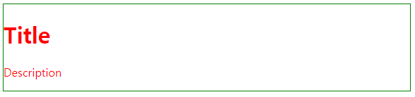

# CSS 상속과 우선순위 

*2019.05.30*


## 1. CSS 상속(inheritance)

CSS 속성에는 상속되는 속성과 상속되지 않는 속성이 있다. 

| 속성 이름       | 상속 가능 |
| --------------- | --------- |
| color           | true      |
| bacground-color | false     |
| padding         | false     |
| border          | false     |

[CSS 상속 참고](https://www.w3.org/TR/CSS2/propidx.html)

일반적으로 box-model이라고 불리는 속성들(width, height, margin, padding, border)과 같이, 크기와 배치 관련된 속성들은 하위엘리먼트로 상속이 되지 않는다.


>**[예제 코드]**
>
>코드를 돌려보면 color는 p태그에도 상속되어 적용되었음을 확인할 수 있다. 반면, border 속성은 상속되지 않으므로 div 태그에만 적용되었다.
>
>```html
><head>
>    <style>
>      .abc {
>        color: red;
>        border: 1px solid green;
>      }
>    </style>
>  </head>
>  <body>
>    <div class="abc">
>      <h1>Title</h1>
>      <p>Description</p>
>    </div>
>  </body>
></html>
>```
>
>


## 2. CSS 우선순위

중첩된 스타일 선언이 존재하는 경우, 어떤 스타일이 최종적으로 반영될까?

1. 원천 소스중 사용자 스타일시트(`inline`)가 가장 우선한다.
2. 선택자 우선순위를 계산하여 값이 높은 순서대로 적용한다.
3. 가장 마지막에 지정된 스타일을 우선적으로 적용한다.


### 2.1. 기본규칙

- 동일한 속성이라면, 나중에 지정된 것이 적용된다.

>```css
>p { color:blue; }
>p { color:red; }
>
>// red가 적용된다.
>```

- 더 구체적으로 선언된 속성이 적용된다.

> ```css
> body > p { color:blue; }
> p { color:red; }
> // blue 가 적용된다.
> ```

- `id` > `class` > `element`


### 2.1. CSS Specificity 

1. 선택자중 ID의 수를 세어 100자리에 놓는다,
2. 선택자중 가상 클래스와 클래스의 수를 세어 10자리에 놓는다.
3. 선택자중 엘리먼트의 수를 세어 1의 자리에 놓는다.
4. 가상 엘리먼트는 무시한다.

| 선택자        | 선택자 우선 순위 계산 |
| ------------- | :-------------------- |
| *{}           | 0                     |
| li{}          | 1                     |
| ul li{}       | 2                     |
| li.num{}      | 10+1 = 11             |
| li.num.last{} | 20+1 = 21             |
| #wrap{}       | 100                   |
| p#wrap{}      | 100+1 = 101           |


