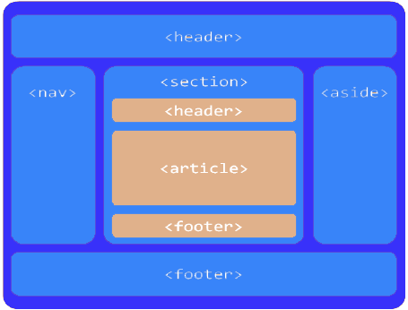

# HTML Layout Tags

*2019.05.30*

## HTML 시멘틱 태그

HTML5에서 새로 추가된 레이아웃을 위한 태그들이다. 태그는 그 의미에 맞게 사용해야 한다.

`header` : 문서의 서론이나 섹션의 목차, 검색, 로그 등이 들어가는 곳이다.

`section` : 글을 구분하는데 사용, 단락 

`article` : 컨텐츠의 내용이 들어가는 부분

`nav` : 네비게이션 영역이며, 페이지 이동을 위한 메뉴들이 모여있는 곳 

`aside` : 보조 메뉴나 광고를 배치하는 곳

`footer` : 저작자의 이름이나 문서의 날짜, 연락처 등 최 하단

