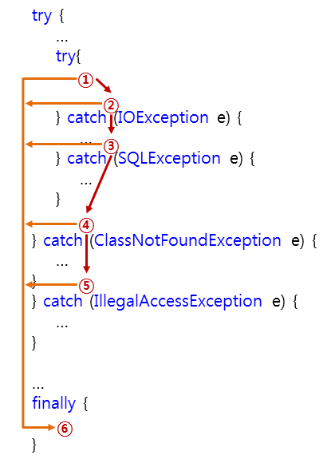

# 예외 처리(exception handling)

> **오류(error)**
>
>- 오류가 발생하면, 시스템 레벨에서 프로그램에 심각한 문제를 야기하므로 실행 중인 프로그램을 종료한다.
>
>- 오류는 개발자가 미리 예측하여 철리할 수 없는 경우가 대부분이다.
>
>  **예외(exception)**
>
>- 오류와 마찬기지로 실행 중인 프로그램을 비정상적으로 종료시키지만, 발생할 수 있는 상황을 미리 예측하여 처리할 수 있습니다.


자바에서는 프로그램이 실행하는 도중 발생하는 예외를 처리하기 위해 try, catch, finally문을 사용할 수 있다.

```java
try{
  // 실행 코드
}catch(e1){
  // e1 예외가 발생할 경우에 실행할 코드
}catch(e2){
  // e2 예외가 발생할 경우에 실행할 코드
}finally{
  // 예외 발생여부와 관계없이 무조건 실행되는 코드
}
```

`try`  : 기본적으로 맨 먼저 실행되는 코드로 여기서 발생한 에러를 `catch`에서 처리한다.

`catch` :  `try`에서 발생한 예외를 인수로 전달받아 처리한다.

`finally` : 예외 발생 여부와 상관없이 무조건 실행되는 블록

- catch, finally 블록은 선택적인 옵션으로 반드시 둘다 사용할 필요가 없다.

> 
>
> 이중 try문(1번) 안에서 에러가 발생하면 2번, 3번 뿐만아니라 같은 에러를 가지고 바깥쪽의 catch문(4, 5번)도 차례로 검사하게 된다.


#### 예외 처리의 계층관계

- 범위가 큰 것을 나중에 명시해야한다.

```java
try {
  System.out.write(list);
} catch (IOException e) {
  e.printStackTrace();
} catch (Exception e) {
  e.printStackTrace();
}
```


#### 여러 예외 타입의 동시 처리

```java
try {
  this.db.commit();
} catch (IOException | SQLException e) {
  e.printStackTrace();
}
```

- 둘 이상의 예외 타입을 동시에 처리하는 catch블록에서 매게변수로 전달받은 예외 객체는 묵시적으로 final 제어자를 가진다. 즉, catch블록 내에서 해당 매게변수에는 어떠한 값도 대입할 수 없다.


#### 예외 발생 및 회피

​	**예외 발생** : `throw` 키워드를 사용하여 강제로 예외를 발생시킬 수 있다.

```java
Exception e = new Exception("오류");
try {
  throw e;
} catch (Exception ex) {
  ex.printStackTrace();
}
```


**예외 회피** : `throw` 키워드를 사용하여 **호출된 메소드에서 발생한 예외를 호출한 메서드로 넘길 수** 있다.

- 호출된 메소드에서 예외를 처리할 경우 main() 메소드는 예외가 발생한 사실을 인질하지 못한다.

  ```java
  public class Exception03 {
    static void handlingException() {
      try {
        throw new Exception();
      } catch (Exception e) {
        System.out.println("호출된 메소드에서 예외 처리");
      }
    }
    public static void main(String[] args) {
      try {
        handlingException();
      } catch (Exception e) {
        System.out.println("main() 메소드(호출한)에서 예외 처리");
      }
    }
    // [결과] '호출된 메소드에서 예외 처리'가 출력된다. main()에서 예외를 알아차리지 못한다.
  }
  ```

- 아래와 같이, 예외를 호출된 메소드가 아닌 호출한 메소드(main())에서 처리하도록 하는 것이 바람직하다.

  ```java
  public class Exception03 {
    static void handlingException() throw Exception {
      throw new Exception();
    }
    public static void main(String[] args) {
      try {
        handlingException();
      } catch (Exception e) {
        System.out.println("main() 메소드(호출한)에서 예외 처리");
      }
    }
    // [결과] main() 메소드(호출한)에서 예외 처리
  }
  ```


#### try-with-resources 문

- 사용한 자원을 자동으로 해제하는 구문이다.
- try블록에 괄호를 추가햐어 파일을 열거나 자원을 할당하는 명령문을 명시하면, 해당 try 블록이 끝나자마자 자동으로 파일을 닫거나 할당된 자원을 해제한다.

```java
// try(파일을 열거나 자원을 할당하는 문){...}
try (BufferedReader br = new BufferedReader(new FileReader(filePath))) {
  return br.readLine();
}

// try-with-resources를 사용하지 않는 경우, BufferedReader로 읽어온 파일을 닫아줘야한다.
BufferedReader br = new BufferedReader(new FileReader(filePath));
try {
  return br.readLine();
} finally {
  if (br != null)
    br.close();	// 자원 닫기
}
```

