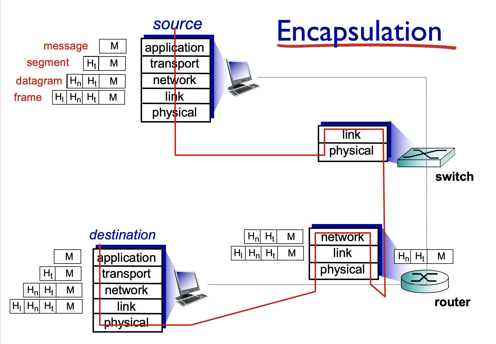

# Ch1. 컴퓨터 네트워크와 인터넷

> 인터넷과 프로토콜 이해하기

### I. 인터넷의 구성요소

1. [인터넷의 가장자리] host = end systems : 사용자 컴퓨터
   - 최근 모든 가전이 컴퓨터와 되고 있음. 즉, end system은 이제 단순히 컴퓨터 뿐만아니라 가전으로도 볼 수 있다.
2. [인터넷의 중앙] router, switch : 네트워크에서 사용자의 메시지가 목적기까지 갈 수 있도록 도와주는 것
3. [연결] cummunication links : 실제 물리 회선으로 host와 router를 연결한다.

- `internet` = network of networks : 네트워크들의 네트워크를 인터넷이라 한다.
- `protocols` : 네트워크 상에서 메시지를 주고 받을 수 있는 일련의 규칙을 의미한다.
  - protocol은 표준화가 중요하다. 
  - 인터넷 표준 기관은 IETF, 표준 규약은 RFC

### II. 프로토콜이란?

- 프로토콜은 보내고 받는 메시지의 포멧, 순서, 액션 등을 정의하고 있다.

- 컴퓨터 네트워크에서 메시지를 보내려면 정확한 포멧을 따라야하며, 메시지를 주고 받는 순서를 지켜야한다.

### III. 네트워크의 가장자리

> end system, access network, links

#### 1. access network

- **유저 호스트들이 네트워크에 연결시켜 주는 것**
- wired, wireless communication links
- `bandwith`, `transition rate` : 초당 전달할 수 있는 비트 수를 의미하며, access network의 중요한 특징 중 하나이다.
- shared or dedicated : 공유된 네트워크, 전용 네트워크로 구분할 수 있다.
- KT, SKT 등 전화 케이블 회사는 access network를 제공해주는 회사이다.

1. ***[홈 네트워크] 집 내부에 설치된 라우터가 집에 있는 엔드 시스템들을 묶어주고 전화나 케이블 회사의 모뎀에 연결된어 네트워크에 접속이 가능하게 만든다.***
   - **disital subscriber line(DSL)** : 전화 회사에서 제공해주는 엑세스 네트워크, 전화 회선으로 네트워크에 접속하므로, 일반적으로 dedicated이다. 
   - **케이블 네트워크, hybrid fiber coax(HFC)** : 케이블 회사에서 제공해주는 네트워크, 케이블은 브로드캐스팅을 진행한다. 모든 세대가 같은 시간대에 똑같은 방송을 본다. 즉, shared network이다. 
2. ***[학교, 회사 등 기관 네트워크] 집보다 엔드 시스템이 훨씬 많기 때문에 `이더넷 스위치`를 이용한다. 여러개의 이더넷 스위치가 다시 기관 전체를 연결하는 라우터에 연결된다. 그리고 라우터는 `ISP(인터넷에 직접 연결, dedicated)`에 연결되어 기관에서 인터넷을 사용할 수 있도록 만든다.*** 즉, 케이블이나 전화회사와 연결되지 않는다.

#### 2. wireless access networks 

- **wifi** : 이더넷 스위치에 연결되고 스위치는 라우터에 연결되어 네트워크 접속이 가능하다. 건물 내부에서 사용
- **LTE** : 셀룰러 네트워크로 넓은 지역에서 사용한다.
- shared network

### IV. 네트워크의 코어

> - packet switching, circuit switching, network structure
>
> - 라우터와 스위치들이 복잡하게 연결되어 있다. 그리고 네트워크 코어의 목표는 사용자의 메시지를 목적지까지 전송해주는 것이다.

#### 1. circuit switching : 회선 네트워크

- 대역폭을 나눠서 데이터를 전달한다. 여러명이서 동시에 나눠서 사용 가능하지만 동시에 사용할 수 있는 사용자 수에는 한계가 존재한다.
- 전화 회선 답게 목적지와 전달지가 계속 연결되어 있어야 한다. 즉, 전달하려는 데이터가  목적지 주소를 가지고 있을 필요가 없다. 연결된 링크를 타고 전달된다.
- 음성에는 적합하지만, 데이터가 간혈적으로 오고가는 인터넷에서 네트워크가 계속 연결되고 있는 것은 낭비가 심하다.

#### 2. packet switching : 인터넷 네트워크

- **필요가 발생하면 링크 대역폭 전체를 바로 바로 사용할 수 있도록 만든다. 이미 누가 사용하고 있다면, 대기하다가 사용**
- 만약 메시지 하나가 엄청 길다면? 
  - 유저 메시지를 일정한 크기의 packet으로 잘라서 네트워크에 전달한다. 
  - 목적지와 바로 연결해주는 작업을 수행하지 않으므로 각 **packet에는 목적지 주소가 담겨있어야 한다.**
- **store and forward** : 결국, 각 라우터는 패킷이 다 전송될 때까지 기다리다(store)가 주소를 뽑아내고 다른 라우터로 전달(forward)한다.
- `queueing delay` : 링크를 독점하므로, 이미 누군가가 링크를 사용하고 있다면 라우터의 버퍼에서 전달될 패킷이 대기하게 된다. 만약, 나가는 데이터보다 들어오는 데이터가 더 커서 패킷이 버퍼에 계속 쌓이는 딜레이 시간을 `queueing delay`라고 지칭한다. 
- `loss` : 버퍼가 가득 패킷이 쌓여있는데, 또 패킷이 들어오면 데이터 손실이 발생한다.
- `congestion` : `queueing delay`가 심해지고 `loss` 까지 발생하는 상황을 말함

#### 3. network structure

- 네트워크의 네트워크로 연결된 구조이다.
- 즉, 어떤 지점이든 네트워크에 연결되어 있다면 원하는 지점으로 연결할 수 있게 된다.

### V.  패킷 교환 네트워크에서의 지연, 손실과 처리율

> 네트워크의 성능을 표현 : delay, loss, throughput

#### 1. delay

한 노드를 통과하기 위한 delay는 아래와 같다.

##### nodal delay = `propagation delay `+ `queueing delay` +` transmission delay` + `propagation delay`

>- R : link bandwidth
>- L : packet length
>- a : average packet arrival rate
>- d : length of physical link
>- s : propagation speed

1. `transmission delay` : 패킷을 링크로 밀어넣는 시간
   - **L/R** : 패킷이 길수록 delay가 커지며, 단위 시간당 패킷을 밀어 넣는 속도(bandwidth)가 클수록 delay가 작아진다.
2. `propagation delay` : 비트가 링크에 실리고 다음 노드에 도달하기까지 시간
   - **d/s** = 링크의 길이/전파 속도
3. `queueing delay` : 유일하게 **가변적**, 내보낼 수 있는 양보다 더 많은 양의 데이터가 들어올때 버퍼에 저장하게 되고 이 버퍼에서 대기하는 시간을 말한다.
   - **aL/R** : 단위시간당 유입되는 패킷의 양(aL)에 비례한다.
   - aL/R > 1 : 트래픽이 무한정 늘어난다.
   - aL/R < 1 : 안정적이다.
   - 그런데, aL/R의 증가 곡선을 보면 0.7이상부터 딜레이 값이 무한대로 증가하는 것처럼 보인다. average packet arrival rate로 유입 속도를 판단하므로 어느 순간에 유입량이 큰 경우가 있을 수 있다. 이런 경우, 큐에 패킷이 쌓이게 되고 queueing delay가 증가하는 모습을 보인다.

#### 2. Packet loss

큐가 꽉차있을 때, 패킷이 계속 들어오는 경우 손실(loss)이 발생한다. 이런 경우, 사용자는 재전송을 해야하므로 delay가 길어지고 네트워크 입장에서는 resource 낭비가 심하다.

#### 3. Throughput

**출발지부터 목적지까지 단위시간동안 배달한 양**

- 전체 패킷 경로 중 capacity가 작은 링크에 의해 값이 결정된다.
- 즉, 출발지부터 목적지까지 여러 경로(링크)가 존재하는 데, 그 중 가장 작은 링크의 capacity에 의해 Throughput이 결정된다.
- **bottleneck link** : 출발지부터 목적지까지 경로상의 링크 중, 제일 대역폭이 작은 링크, 일반적으로 엣지쪽일 확률이 높다.

### VI. protocol layers, service models

프로토콜은 복잡한 시스템이므로 layering 구조를 가지고 있다. 

- layering하는 경우, 복잡한 시스템의 부분을 정의하고 관계를 정의하는 것이 쉽다. 또한, 구현과 업데이트가 용이해진다.
- 그러나  layer는 자신의 고유 목적이 존재하는데, 이  layer간 목적이 중복될 수 있다. 다른  layer의 정보를 필요하게 되는 경우가 있을 수 있다.

#### 1. Internet protocol stack💡

인터넷은 5개의 프로토콜 레이어로 구성되어 있고 각 계층은 목적을 가지고 있다.

1. `application`

   - 목적 : 네트워크 어플리케이션 프로그램을 지원하는 것

   - 종류 : FTP, SMTP, HTTP

   - 예) HTTP는 웹 어플리케이션을 지원하는데 데이터를 주고 받기 위한 url, method 등을 모두 정의함으로써 웹 프로그램이 정상적으로 작동하는 것을 돕게된다.

   - 각 네트워크 어플리케이션을 지원하기 위한 프로토콜이 application 계층에 정의되어 있다. 

     **즉, 유저가 만든 메시지를 포장해서 전송가능한 패킷(메시지)으로 만드는 작업을 수행한다.** 그리고 이 메시지를 transport 계층에 보내서 목적지까지 전달을 부탁한다.

2. `transport`

   - 목적 : (출발지)process-(목적지)process data transfer
   - 종류 : TCP, UDP
   - 출발지의 process는 당연히 출발지의 host에 존재함. 여기서 만든 **메시지를 목적지 호스트의 process에게 전달하는 작업을 transport 계층에서 수행함**
   - <u>근데, 출발지와 목적지의 process간 메시지 전달을 위해서는 출발지와 목적지 host에 전달하는 작업이 선행되어야한다. 그래서 transport 계층 프로세스간 통신을 위해 network계층에게 host to host 전송을 부탁한다.</u>

3. `network`

   - 목적 : **라우팅**을 통해서 데이타그램을 source host에서 destination host까지 전달한다.
   - 종류 : IP, routing protocols
   - 그런데, host끼리 데이터 전송을 하기 위해서는 네트워크상의 링크들을 건너가야한다. 그래서 link 계층에게 네트워크 건너가는 것을 부탁한다.

4. `link`

   - 목적 : 하나의 홉을 건너가기 위해서 physical 계층에 비트를 밀어 넣는다.
   - 종류 : wifi, ethernet

5. `physical`

   - 목적 : 들어온 데이터를 실어 나른다.

> 결국 각 계층은 자신의 아래 계층을 이용해서 자신의 목적을 달성한다.

#### 2. Encapsulation

**[source]**

1. application 계층 : source에서 메시지를 생성한다.
   - M
2. transport 계층 : destination transport 계층에게 편지(헤더: Ht)를 씀
   - segment : Ht + M
3. network 계층 : destination host까지 보내는 헤더를 추가
   - datagram : Hn + Ht + M
4. link 계층 : 다음 홉(link)으로 메시지 전달을 부탁한다.
   - frame : Hl + Hn + Ht + M
5. physical 계층 : 위에서 내려온 프레임을 스위치에 전달한다.

**[switch]**

> 스위치에는 host가 존재하지 않으므로 application,  transport 계층이 존재하지 않음. 또한, 일반적으로 길찾기 기능을 제공하지 않는다. 즉, network 계층이 존재하지 않는다.(연결된 포트로만 프레임을 전달함)

1. physical 계층 : frame이 들어온다.
2. link 계층 : frame을 확인하여 라우터로 전달
3. physical 계층 : frame을 전달한다.

**[router]**

> router에서 메시지를 만들 필요가 없으므로 application 계층이 존재하지 않음. 즉, end system에 속하지 않으므로 transport 계층도 존재하지 않음!
>
> 단, 길을 찾아가야하므로(다른 홈으로 보내야하니까) network 계층은 존재한다.

1. physical 계층 : frame을 받아들임
   - frame : Hl + Hn + Ht + M
2. link 계층 : 들어온 frame이 제대로 들어왔는지 확인한다.(Hl 제거) 네트워크에 올려줌
   - frame : **Hl제거** + Hn + Ht + M => Hn + Ht + M
3. network 계층 : source에서 만든 프레임 Hn를 확인하여(Hn 제거) 올바르게 왔는지 확인
   - frame : **Hn제거** + Ht + M => Ht + M
4. network 계층 : 이제 목적지 호스트에 보내기 위해 자신의 헤더(Hn2)을 추가한다.
   - frame : Ht + M => **Hn2추가** + Ht + M
5. link 계층 : 하나의 홉을 건더뛰고 호스트에 전달하기 위해 자신의 헤더(Hl2)를 추가한다.
   - frame :  Hn2 + Ht + M => **Hl2추가** + Hn2 + Ht + M
6. physical 계층 : frame 전달

**[destination]**

1. physical 계층 : frame을 받아온다.
   - frame : Hl2 + Hn2 + Ht + M
2. link 계층 : 바로 전 router에서 만든 프레임을 검사한다.(H12 제거) 잘 도착했으면 network로 올려보낸다.
   - frame : **Hl2제거** + Hn2 + Ht + M => Hn2 + Ht + M
3. network 계층 : 마찬가지로 올바르게 도착했는지 검사(Hn2 제거)해서 <u>내가 destination이구나!를 판별해서 제대로 왔는지를 판단한다.</u>
   - datagram : **Hn2제거** + Ht + M => Ht + M
4. transport 계층 : source에서 만든 메시지 헤더를 제거하고 올려보낸다.
   - segment : **Ht제거** + M => M
5. application 계층 : 메시지를 받는다.
   - M

> ***각 프로토콜 계층에서는 자신의 기능을 수행하기 위해서 메시지에 헤더를 추가한다. 그리고 각 헤더는 자신의 역할에 대응되는 peer가 읽고 해독한다.***

### VII. Network security

원래 프로토콜 디자인 자체에는 Network security가 고안되어 있지 않았다. 그런데 인터넷이 점점 커지고 아무나 접속이 가능해지면서 Network security를 추가해야할 필요성이 생겼다.

- virus : 사용자가 받아서 executing을 해야지만 실행됨

- worm : 받기만하면 자동으로 self executing을 하고 실행됨
- spyware malware : 키나 방문기록, 다운로드 기록 등을 리포팅하는 소프트웨어
- Botnet : DDos 공격이나 스팸메일을 보내기 위해 오염된 컴퓨터

- DoS : 서버에 계속 쓸모없는 트래픽을 보내서 서버를 마비, 실제 서비스가 불가능하도로 만든다. 타겟 주변의 컴퓨터에 spyware malware를 보내서 Botnet을 만들고 이를 이용해서 공격
- packet sniffing : wifi와 같은 shared work에서 발생한다. 같은 AP를 공유하는 host 끼리는 트래픽 감지가 가능하다. 이를 이용해서 다른 host의 프레임을 엿보는 행위를 말한다.
- IP spoofing : 네트워크의 host가 마치 다른 사람인 것처럼 보내는 것

