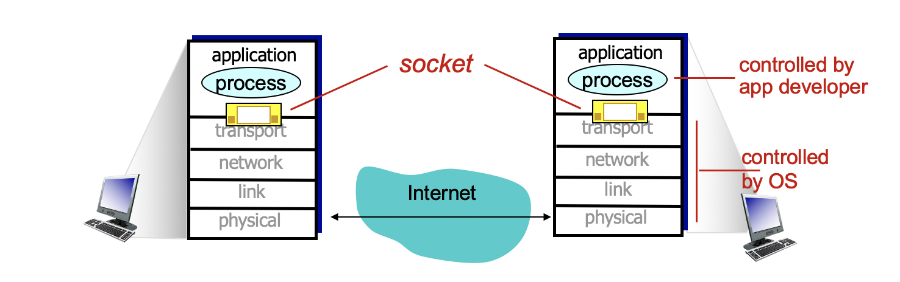
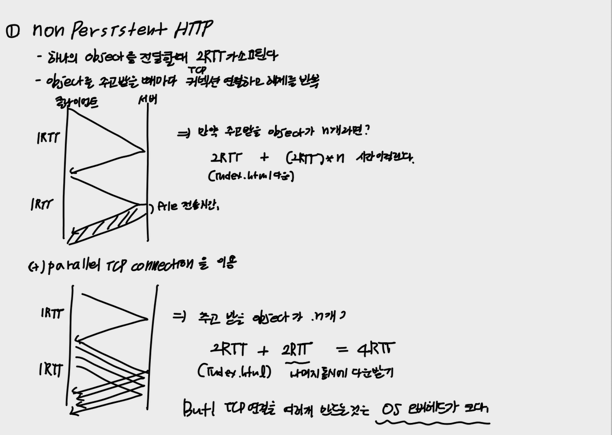
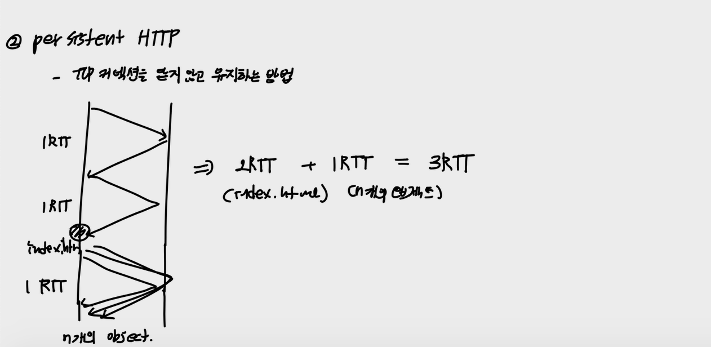
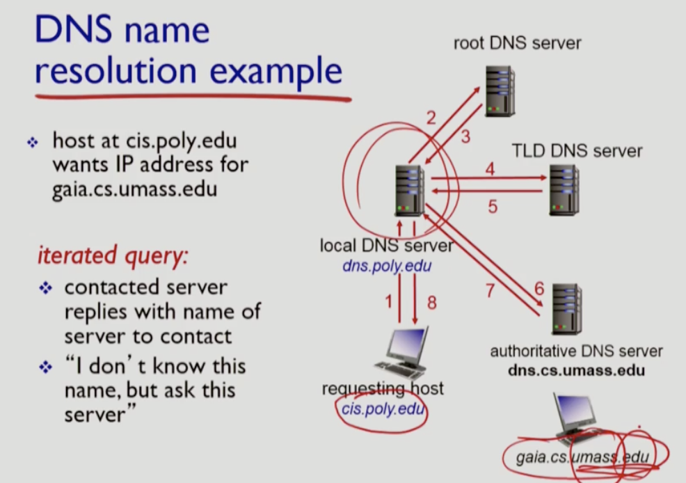
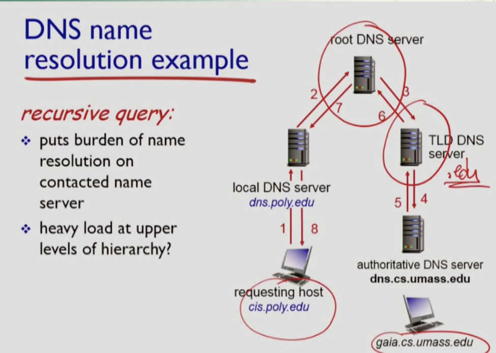
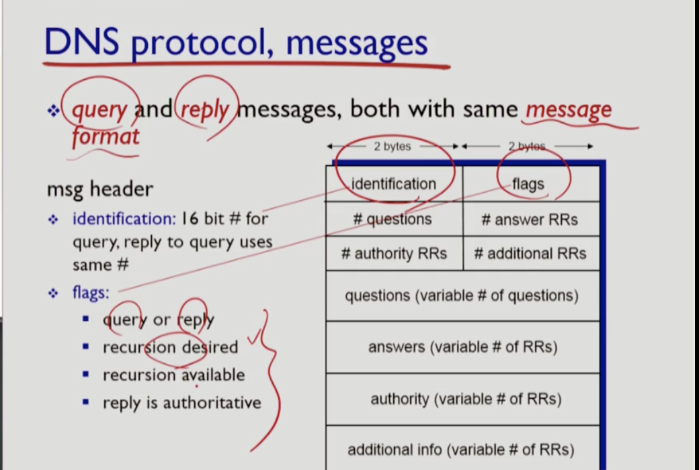
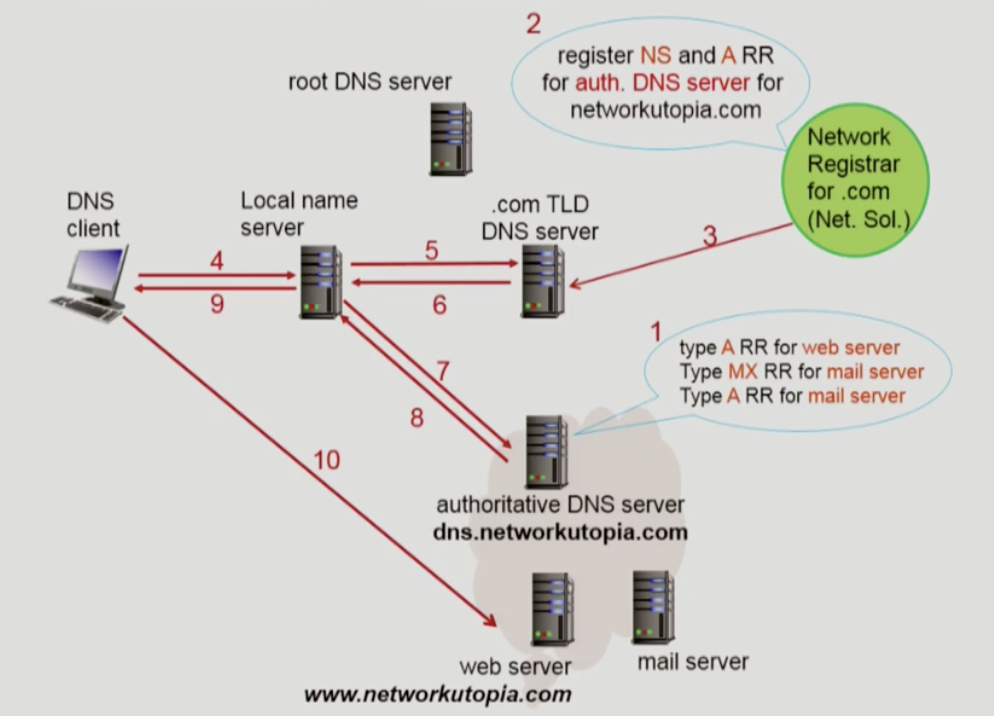

# Ch2. 애플리케이션 계층

> 구조와 개념, 프로토콜, 소켓

## 2.1 Principles of network application

### I. Application  Architecture

network application에는 e-mail, web, p2p file sharing, skype, streaming(youtube) 등이 있다. 대부분의 사용자가 사용하고 있는 앱이 여기에 속한다. 그런데, 이렇게 다양한 application과 application을 지원하는 protocol의 구조는 다음 두 가지로 나뉜다.

- `client-server` 
- `peer-to-peer(p2p)` 

#### 1. Client-server architecture

server host의 프로세스와 client host의 프로세스가 통신을 하는 구조

- server 
  - 언제나 on
  - 영구적으로 할당된 고정 IP

- client 
  - 유동 IP
  - 사용할때만 on

#### 2. P2P architecture

커뮤니케이션하는 프로세스가 모두 user host에 존재한다. 즉, 항상 켜져있는 server가 존재하지 않는다.

- peer
  - user host를 지칭한다.
  - peer는 다른 peer에게 서비스를 제공하고 자신이 서비스를 제공하기도 한다.
  - peer가 서비스를 제공하는 역할도 수행할 수 있으므로, 사용자가 증가하면 서비스 제공할 수 있는 peer가 증가한다. 즉, self scalability하는 장점이 있다.
  - 그러나 peer들이 유동 IP를 가지고 있으므로 관리가 복잡하다는 단점이 있다.

### II. Process communicating

결국 커뮤니케이션하는 주체는 host가 아니라 process이다. 서로 다른 host에서 동작하는 process가 메시지를 주고 받는 것으로 인해 애플리케이션이 돌아가는 것이다. 그래서 통신하는 프로세스는 `client process`, `server process` 두 종류로 나뉜다. 

- client process : 커뮤니케이션을 시작하는 프로세스

- server proces : 커뮤니케니션을 기다리고 응대하는 프로세스

Client-server architecture에서는 각 host에 맞는 process가 동작, P2P architecture에서는 하나의 peer 안에 두 가지 프로세스가 모두 동작

### III. Sockets

application layer에서 메시지를 만들고 해당 메시지 전달을 transport layer에 부탁한다. 그런데, application layer는 앱 개발자가 컨트롤하는 부분이고 그 아래부터는 OS가 컨트롤 한다. 프로그램은 user 영역에 있는 process로 인해 실행되고 메시지 전달은 os 영역에 있는 process에 의해 실행된다. 

이때, application layer와 transport layer 사이의 문 역할을 하는 것이 `socket`이다. 

### IV. Addressing process

메시지를 전달해야할 대상은 host가 아니라 host 내에서 실행되고 있는 process이다. 그렇다면 어떻게 해당 process를 찾아갈 수 있을까? IP 번호가 네트워크에서 host를 찾기 위한 주소라면 **port 번호는 프로세스의 주소**가 된다.

**well kown port number** : 매우 보편적으로 사용되는 process의 경우 port 번호를 고정해서 사용한다.  예를 들면 http 서버는 80, mail 서버는 25를 사용한다. 

### V. Transport service

#### 1. What transport service does an app need? 

application layer에서는 메시지를 transport layer에 전달하는데, 어떤 transport service를 사용해야할까?

- data integrity 
  - 파일 전송과 웹 통신을 진행할 때, 중간 중간 오류가 발생하면 그 서비스에 매우 치명적이다.
  - 반면, 오디오나 비디오 같은 서비스는 data integrity가 치명적이지 않다.
- timing
  
  - 게임, 음성과 같은 경우 딜레이는 치명적이다.
- throughput(처리율)
  
  - 오디오나 비디오 스트리밍의 경우 minimum throughput이 보장되어야한다. 단위 시간당 처리할 수 있는 프레임이 보장되어야 화면에 지연이 발생하지 않는다.
  
  - 반면, FTP 같은 파일전송 시스템의 경우, throughput이 낮더라도 파일이 느리게 전송될 뿐 치명적이지 않다.

- security
  - 뱅킹 서비스를 사용하는 앱의 경우 보안이 가장 중요하다.

즉, 어플리케이션마다 원하는 Transport service가 다르다.

#### 2. Internet trasnport protocols service

인터넷에서 transport service를 제공하는 protocol에는 TCP와 UDP가 있다.

|                                                              | TCP  | UDP  |
| :----------------------------------------------------------- | :--: | :--: |
| **reliable transport** - 상대방에게 오류 없이 전송함을 보장 |  O   |  X   |
| **flow control** - 전송하는 데이터의 순서를 보장 - 들어오는 데이터 양을 체크해서 속도를 조절하여 버퍼 오버플로우를 방지한다. |  O   |  X   |
| **connection-oriented** - 상대방과 connenction을 확인하는 과정(hand shaking)을 거친다. |  O   |  X   |
| **congestion control** - 네트워크 상의 데이터 경로 상의 혼잡이 발생할 때, 버퍼에서 내보내는 데이터 속도를 줄인다. |  O   |  X   |
| **timing, minimum throughput guarantee, security**           |  X   |  X   |

왜 UDP를 사용할까? UDP는 상대방과 connenction을 확인하는 과정(hand shaking)을  거치지 않고 오로지 데이터 전송에만 집중한다. **TCP는 connection 수립하는 handshaking과 connection을 통해 트래픽을 관리하는 오버헤드가 발생**한다. 즉, 메시지를 하나만 보내는 간단한 어플리케이션에서 TCP를 사용하는 것은 배보다 배꼽이 더 큰 것과 같다. 스트리밍과 같이 데이터의 손실보다 처리율이 중요한 경우에는 UDP를 사용한다.

### IV. Application layer protocol defines

애플리케이션 프로토콜에서 정의되어야 하는 것

- type of message exchanged
- message syntax
- message semantics
- rules

## 2.2 Web and HTTP

웹 페이지는 여러 개의 object로 구성되어 있는데, 기본적으로 웹 페이지의 프레임을 **base HTML 파일**(보통 index.html)이 가지고 있다. 그리고 그 안에 URL 형태로 object 정보를 가지고 있다. (이때, object는 HTML file, 이미지, 오디오 등)

### I. HTTP : hypertext transport protocol

1. WEB 어플리케이션을 위해 만들어진 프로토콜로 `client-server` 구조를 가지고 있다.

   - client process : 사용자의 브라우저
   - server process : 서버 host에서 실행되어 client host의 메시지를 기다림

2. `TCP`를 사용한다.

   - 웹은 데이터 손실이 일어나면 안된다. 즉, data integrity가 보장되어야하므로 TCP를 사용한다.
   - 클라이언트에서 TCP 서버에 connection을 요청하고 서버(port 80)측에서 이에 응답해서 메시지를 주고 받는다.

3. `stateless` 

   - 유저가 이전에 보낸 request가 뭐였는지 기억하고 있지 않음

4. `persistent HTTP`

   - 서버와 클라이언트사이에서 여러개의 object가 하나의 TCP connection을 통해 전달 가능

   > 원래는 **non-persistent HTTP** 이었는데, 바뀜
   >
   > non-persistent HTTP은 서버에서 요청을 보내고 나면 TCP connection을 바로 닫아버리는 것이다. 그런데, HTML 문서는 여러개의 object로 이뤄져 있어 모든 object를 다운받기 위해서는 매번 TCP connection야 하므로 매우 비효율적이었다. 그래서 지금은 `persistent HTTP`를 이용한다.
   
   

#### non-persistent HTTP vs persistent HTTP

- RTT = rount trip time
- **제일 첫번째 RTT는 클라이언트와 서버의 TCP 연결하는 부분이다.**

### II. HTTP request message

- http 메시지 타입은 두가지 : request, response
- ASCII 코드로 작성되어 있다.
- 소켓을 통해서 메시지를 주고 받으므로 host를 작성할 필요가 없어보이는데, HTTP 메시지를 까보면 HOST 정보가 나열되어 있다. 왜 그럴까???
- method type
  - HTTP/1.0 : **서버에서 어떤 리소스를 요청하기 위한 메서드**
    1. `POST`
       - url에 값이 노출되지 않는다.
    2. `GET`
       - url 부분에 파라미터로 요청을 넘긴다. 보안에 취약
    3. `HEAD`
       - 서버에 request를 보낼때, response를 꼭 받지 않아도 되는 요청, 주로 테스트 용으로 사용한다.
  - HTTP/1.1 : **HTTP 클라이언트에서 서버의 리소스를 관리할 수 있게 되었다.**
    1. GET, POST, HEAD
    2. `PUT` 
       - 서버에 어떤 파일을 업로드하라는 요청
    3. `DELETE`
       - 서버에서 해당 경로에 있는 파일을 삭제하라는 요청

## 2.3 DNS(domain name system)

웹 브라우저에서 어떤 웹 사이트에 접속하길 원할 때, 사용자가 입력하는 주소를 hostname이라 한다. 그런데, 실제 클라이어트 프로세스에서 서버 프로세스에 연결할 때는 이러한 hostname으로는 찾아갈 수 없다. 그래서 해당 host name에 해당하는 IP주소를 찾아내고 그 서버로 연결 요청을 보내게 된다. **결국, 모든 네트워크 앱들은 사용자가 접속하는 hostname에 해당하는 IP주소로 매핑하는 시스템이 필요하다.  그리고 이러한 매핑 작업을 수행하는 것이 바로 `DNS(domain name system)`이다.**

- distributed database를 이용해 매핑정보를 저장하고 있다.
- 모든 네트워크 어플리케이션에서 필요로 하는 작업이므로 네트워크 계층에서 제공하는 것이 합당해보이지만 어플리케이션 계층에서만 제공한다.(네트워크 계층에서는 패킷 전송에만 집중하기 위해서)

>`도메인네임(domainname)` : 네트워크 상에서 컴퓨터를 식별하는 호스트이름을 가리키며, 도메인 레지스트리에 등록된 이름
>
>예) 네이버의 메인 페이지 주소인 naver.com이 도메인네임이 된다.

>`호스트네임(hostname)` : 네트워크에 연결된 장치들에게 부여되는 고유한 이름
>
>예) 네이버 메일과 웹툰의 경우 각각 mail.naver.com와 comic.naver.com를 사용하는데, 여기서 mail과 comic이 호스트네임이고 naver.com이 도메인네임이 된다.

### I. DNS 역할

1. hostname to IP address translation
2. host aliasing 
   - 실제 hostname과 다른 별명을 지어준다.
   - 예를 들어, mm.com(별명)이라는 주소로 접속 했을 때 mmserver.com(실제 hostname)로 변하는 서비스가 있다.
3. mail server 
   - 메일 서버를 알려주는 서비스
4. laod distribution
   - 인기가 많은 웹서버가 있을 때, 그 웹서버를 찾는 클라이언트 요청이 많아진다. 그 웹서버가 여러 개 설치되어 있을 수 있다. 그럼 그 중 한 곳으로 연결해주는 것을 말한다.

### II. DNS : distributed, hierarchical database

> 그렇다면 DNS는 centralize(중앙집중)을 사용할 수 없을까? 트래픽 몰림, 멀리서도 한 곳으로 요청을 보내므로 응답 시간이 길어진다. 그리고 그 과정에 많은 네트워크를 걸치게 되므로 네트워크 리소스 낭비가 심해진다. 또한, 데이터베이스도 엄청 커질 것
>
> 그래서 distribution(분산) 형태로 서비스가 제공된다.

- DNS는 분산 형태이며, 계층 구조를 가지고 있다.
  - [총 3단계] root DNS server => .com, .org, ....(TLD server : top-level domain) => 각 회사별 도메인을 담당하는 DNS 서버(authoritative DNS server) 이런식으로 계층적인 구조를 가진다.
- Local DNS name server  : DNS 서버의 계층 구조에 속하지 않는 서버
  - 국가, 회사, 대학 등 각각의 기관이 DNS 서버를 설치를 해두고 클라이언트가 발생시키는 모든 요청이 해당 DNS 서버로 들어가도록 만든다. 매핑 정보를 가지고 있으면 대답을 해주고 매핑 정보가 없다면 실제 계층적 DNS 서버에 요청을 보낸다.(캐싱하는 것과 같은 원리)
  - 로컬 사이트 내에서 DNS 서버의 대행자 역할을 한다.

#### 1. iterated query(반복)

#### 2. recursive query(재귀)

- `recursive query`를 사용하면 root DNS server에 쿼리가 몰리게 된다. root DNS server는 개수가 적고 모든 DNS를 관리하므로 부하가 몰리면 안된다. => caching이 필요한 이유

### III. DNS: caching, updating records

- **일반적으로 `local DNS serve`r는 TLD 서버를 캐싱하고 있다.** 그러므로 root DNS server의 접속을 최소화 할 수 있게 되다.

- `out of date` : DNS 매핑정보에는 언제나 TTL(time to leave : 이 시간 동안만 킵해) 정보가 들어가 있다. 그러나 캐싱하고 있는동안 hostname을 변경하는 이벤트가 일어난다면, `out of date`가 발생한다.
  - 그래서 name이 변경되면 노티를 주는 방법이 고안되어 있다.

### IV. DNS protocol, messages

- query와 reply 모두 같은 메시지 포멧을 사용한다. 

- `identification` : 

  - query를 내보낼 때, 특정 숫자를 실어 보내면 reply 메시지를 내보낼때도 같은 숫자를 복사해서 보낸다. 이로인해 query와 reply를 짝지을 수 있게 된다.
- `flags` : 

  - query와 reply를 구분
  - recursion 여부를 표시해서 보냄
  - reply가 authorirative인지 알려줌

- `questions`
  - name, type이 들어간다.
  - 즉, name = hostname, type=A를 던질 수 있다.
- `answers `
  - 응답을 담아서 보내준다.(RR)
- `authority`
  - authoritative DNS server에서 보낸 응답인지 알려줌
- `additional info` 
  - 더 필요할 수 있는 추가정보들

### V. DNS records

- DNS : distributed db storing resources records (RR)

- **RR format : (name, value, type, ttl)**

  1. type = A : 기본

     - name = hostname
     - value = IP

  2. type = CNAME : 별명과 연결해줄 때

     - name = alias name
     - value = canonical name

  3. type = MX : 어떤 도메인의 메일서버

     - name : domainname
     - value : mail srever name

  4. type = NS : 

     - name : domainname 
     - value : 해당 domainname을 담당하는 authoritative name server

     

#### 그렇다면, 각각의 도메인 서버들은 어떤 종류의 RR을 가지고 있을까?

- **Root** : 각 TLD에 대한 정보를 가지고 있다. 즉, `NS type`의 RR을 사지고 있다.
- **TLD** : 각 authoritative DNS server의 정보를 가지고 있는데, 그들에 대한 `NS type`에 대한 정보를 가지고 있다.
- **Authoritative** : hostname을 IP 주소를 변환하는 역할, 즉 기본적으로 `A type`을 가지고 있다.

>**도메인 생성과정**
>
>
>
>1. A라는 회사가 탄생했다.
>2. 자신의 회사 안에 authoritative DNS server를 설치 및 구매한다. (자신의 회사의 모든 컴퓨터에 대한 hostname과 IP주소를 저장하기 위해서) + 추가로 메일 서버나 웹 서버를 추가로 구매한다.
>3. 외부 세상에서 회사의 웹 서버에 접속할 수 있도록하기 위해, 구매한 웹 서버의 hostname과 IP 주소를 매핑하는 type A 레코드를 자신의 authoritative DNS server에 저장해둔다.(메일 서버도 마찬기지로 등록한다. 이때는 MX타입과 A타입 모두 필요함)
>4. .com 도메인을 관리하는 TLD 서버에 회사의 서비스를 등록하다.(회사의 authoritative DNS server의 이름과 IP주소를 알려준다. NS type) : 도메인 등록하는 과정
>
>**일반 사용자가 해당 도메인에 접속하는 과정**
>
>1. 사용자가 A라는 회사의 도메인으로 브라우저에 접속한다
>2. 그럼 사용자가 속한 local DNS name server에서 TLD를 뒤져서 .com 부분에 A회사의 값이 있는지 조회한다. 없다면 TLD로 A회사의 authoritative DNS server의 주소를 요청한다.
>3. A회사의 authoritative DNS server에 다시 IP 주소를 달라는 요청을 넘긴다.
>4. authoritative DNS server는 사용자에게 IP주소를 알려준다.
>5. 사용자가 A 사이트에 접속할 수 있게 된다.(HTTP 리퀘스트를 보낸다.)

## 2.4 socket programming: TCP, UDP

`socket`은 application layer와 transport layer 사이의 상호작용이다.

### I. socket programming with UDP

- UDP는 클라이언트와 서버 사이의 connection을 setup하지 않고 바로 메시지를 보낸다. 그래서 데이터를 보내기 전에 handshaking 과정이 없다. 그래서 **각 데이터마다 목적지 주소(IP와 port)를 붙여서 보내야한다.**
- 서버쪽에서는 보통 80포트로 웹 프로세스를 실행시키고 있어서 클라이언트가 요청을 보낼때, 문제가 되지 않는다. 그렇다면 **서버에서 클라이언트로 응답을 보낼 때, 클라이언트의 포트번호는 어떻게 알아낼 것인가? 요청으로 들어온 세그먼트를 통해 알아낸다.**

#### 1. UDP 통신 과정

| UDP server                                                   | client                                                       |
| ------------------------------------------------------------ | ------------------------------------------------------------ |
| 서버의 프로세스가 실행되고 소켓이 생성된다. 이 프로세스의 포트번호는 지정된 값이어야 한다. |                                                              |
|                                                              | 클라이언트 소켓이 생성된다. 클라이언트 소켓(내보내는 메시지)에 서버의 IP주소와 port번호를 붙여서 보낸다. |
| 네트워크로부터 전달된 클라이언트 소켓을 서버소켓이 읽는다.   |                                                              |
| 서버 소켓으로 응답을 내보낸다. 당연히, UDP이므로 클라이언트의 IP와 port번호를 붙여줘야 한다. ***(문제는 클라이언트 프로세스도 자신의 IP와 port번호를 모른다. 클라이언트의 소켓은 OS가 알아서 임의로 생성하기 때문)* 클라이언트에서 UDP로 소켓을 내보낼 때, 자신의 IP와 port번호를 붙여서 보내준다. 이를 활용해서 클라이언트의 IP와 port를 알아내고 응답을 생성해서 보내준다.** |                                                              |
|                                                              | 클라이언트는 자신의 소켓을 통해서 전달받은 데이터를 읽는다.  |
|                                                              | 클라이언트 소켓을 닫는다.                                    |
| 서버 소켓은 계속 실행중이다. (사전 connection이 없는 UDP의 경우, 언제 어디서 요청이 들어올지 모르기 때문) |                                                              |

### II. socket programming with TCP

- 서버의 TCP 프로세스가 실행되고 소켓(door)을 하나 미리 생성한다. 이때의 소켓은 클라이언트의 연결 요청을 받아들이기 위한 용도이다.(`door socket`이라고 부른다.)
- 클라이언트에서도 앱이 실행되고 TCP 소켓이 생성된다. 그리고 이 소켓에는 연결할 서버의 IP와 port번호가 포함된다. 그리고 이 클라이언트 TCP 소켓이 생성되면서 서버쪽 TCP 소켓과 connection을 맺게 된다.
- 서버쪽의 door socket이 클라이언트로부터 connection 요청을 받으면 **이 클라이언트만을 위한 socket을 새로 생성하고 이를 통해 클라이언트와 통신한다.**(`connection socket`)
- **그래서 TCP로 데이터를 주고 받을 때, connection을 setup한 뒤에는 목적지를 따로 명시하지 않는다.** 목적지를 명시하지 않아도 그 소켓을 통해서 내려오는 데이터가 어디서 오는지 이미 TCP 측에서 알고 있기 때문이다.

#### 1. TCP 통신 과정

| TCP server                                                   | client                                             |
| ------------------------------------------------------------ | -------------------------------------------------- |
| 서버의 프로세스가 실행되고 `door socket`이 생성된다. 이 프로세스의 포트번호는 지정된 값이어야 한다. |                                                    |
| 커넥션 요청이 들어오길 기다린다.                             |                                                    |
| `door socket`이 클라이언트 요청을 받아서 `connection socket`을 새로 생성한다.(TCP 연결을 수립한다.) | 클라이언트 소켓이 생성되고 서버에 연결을 요청한다. |
|                                                              | 클라이언트 소켓을 통해 요청을 보낸다.              |
| `connection socket`을 통해 요청을 받고 응답을 내보낸다.      |                                                    |
|                                                              | 클라이언트는 응답을 읽은 뒤, 소켓을 종료한다.      |
| `connection socket`을 종료한다.                              |                                                    |

