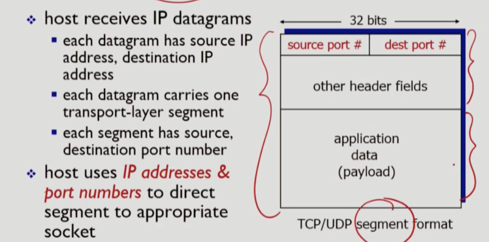

# Ch3. 전송 계층

> `network layer` : logical communication between **hosts**

> `transport layer` : logical communication between **processes**

## 3.1 transport-layer services

- provide **logical communication** between app processes running on different hosts

### I. Internet transport-layer protocols 

1. `TCP` 
   - congestion control(네트워크 오버레이 방지)
   - flow control(리시버 오버레이 방지)
   - connection setup
   - in-order delivery
   - reliable
2. `UDP`
   - unordered delivery
   - unreliable

## 3.2 multiplexing and demultiplexing

- `multiplexing` :  다중화는 여러 프로세스에서 내보내야할 메시지를 하나로 합쳐서 네트워크로 내보내는 것
- `demultiplexing` : 역다중화는 데이터를 받은 뒤, 각각을 나누고 목적지 프로세스에 전달하는 것

- 즉, 보내는 측에서는 `multiplexing`, 받는  측에서는 `demultiplexing`

### I. How demultiplexing works?

> 어떻게 목적지의 주소를 알아낼 수 있을까?

transport-layer에서 만들어 내는 세그먼트를 확인하면 header와 palyoad로 크게 두 부분으로 나뉜다. 

1. header : 
   - source port #와 destination port #가 필수로 들어간다.
   - transport-layer에서 목적지와 자신의 port를 추가한다.(IP 주소는 network-layer에서 추가함)
2. payload
   - application layer에서 작성한 정보

#### 1. Connectionless demultiplexing : UDP

> 클라이언트와 서버 모두 데이터를 주고 받을 수 있다. 즉, demultiplexing은 데이터를 받는 곳인 서버와 클라이언트 부분 모두에서 일어난다.

1. recall host : 소켓이 생성되고 host-local port #가 할당된다. 이 UDP 소켓을 통해서 데이터그램을 보낼때는 반드시 목적지의 IP주소와 port #를 명시해야한다.
2. receives host : UDP 세그먼트를 받고 목적지 port #를 확인해서 이것에 해당하는 프로세스로 데이터를 전달한다.
   - ***그런데 UDP 통신을 하는 프로그램은 하나의 소켓만을 열어둔다. 그래서 모든 UDP 요청이 하나의 소켓으로 들어온다. 그래서 클라이언트의 요청을 포트 번호로 구분하는데, 잘 생각해보면 포트번호는 해당 클라이언트 호스트의 로컬 포트 번호이다. 즉, 다른 호스트와 겹칠 가능성이 있다. 그래서 네트워크 계층에서 IP주소를 추가로 작성한다.***

#### 2. Connection-oriented demultiplexing : TCP

- Connection-oriented의 경우에는 연결 요청이 올때마다 하나의 클라이언트만을 위한 소켓을 열어주는 작업을 수행한다. 즉, 서버측에 생성된 소켓이 여러개이다. 그래서 이때 reciver 측에서 필요한 자원은 크게 4가지 이다.
  - source IP address 
  - source port number => TCP를 통해 연결된 클라이언트의 정보(source)를 통해, 새로 생성된 connection socket을 찾아낼 수 있게 된다.
  - destination IP address => 제대로 host를 찾아왔구나!
  - destination port number => door socket(실제 application socket, 어떤 앱이구나 판별 가능)

## 3.3 connectionless transport : UDP

- connectionless으로 handshaking 과정이 없으며 각 세그먼트의 순서를 제어하지 않는다. 즉, 각 세그먼트는 독립적으로 동작한다.

- 즉, 네트워크 상에서 문제가 생기면 세그먼트를 전달받지 못할 수도 있다. 그러나 이를 받는 측에서는 누락 여부를 알수없다.

- UDP의 사용
  - streaming multimedia : 손실에 민감하지 않음, 속도가 더 중요하므로 UDP를 사용한다.
  - DNS : 쿼리를 지속적으로 보낼 필요가 없음, 딱 한번만 요청을 보내므로 UDP를 사용하다.

- 장점
  - 커넥션을 만들 필요가 없어서 데이터를 내보낼때, 별도의 오버헤드가 없고 딜레이가 적다.
  - 간단하다. 모든 세그먼트가 독립적으로 전송되므로 별도의 커넥션을 유지할 필요가 없음
  - 헤더 사이즈가 작다. multiplexing과 demultiplexing을 위한 정보(source port#, destinetion port #)만 가지고 있음
  - 혼잡 제어(congestion control)를 하지 않음. 즉, 어플리케이션이 데이터를 생성하는 속도로 네트워크 상에 데이터를 밀어넣을 수 있다.

### I. UDP segement structure

> source port #, destination port #는 CH2에서 했음

#### 1. UDP checksum

`checksum` field는 UDP 계층에서 transmitted error를 검출하기 위한 것이다.

1. sendeing UDP는 세그먼트의 헤더를 16bit의 연속으로 보고 전부 더하는 작업을 수행한다.

   

   - 연속된 16bit의 합을 구하고 캐리비트를 다시 더해준다.
   - 그런뒤, 1=>0, 0=>1로 변환하는 과정을 통해 `checksum`을 생성한다.

2. receiver UDP 역시 같은 일을 수행한다. 들어온 세그먼트 헤더 정보를 이용해 `checksum`을 구한 뒤, 그것이 sendeing UDP가 작성해서 보내준 `checksum`과 같은지 확인한다. 

   - 일치하면 손실이 없다.
   - 불일치라면 오는 동안 에러가 발생했구나를 알 수 있다.

그러나 이러한 `checksum`만으로는 모든 transmitted error를 발견할 수 없다.(절묘하게 손실되는 경우에 결과 값이 같을 수도 있다.)

> 그런데, 어차피 UDP는 unreliable로 신뢰할 수 없는 전송을 하는데, `checksum	`을 확인해서 뭐하지? 그냥 오류 여부만 확인하고 어떤 액션을 수행하지 않음... 그냥 어플리케이션에 알리기만 한다.

#### 2. length 

- UDP의 `length`는 **세그먼트의 전체 길이**를 알려준다.

## 3.4 principle of reliable data transfer

**reliable data transfer를 하기 위해 어떤 조건들이 필요할까?**

- `checksum` : 전송 패킷의 오류 여부를 확인하는 필드

- `acknowledgement` : 오류 여부를 상대방에게 알릴 수 있는 것으로 일반적으로 sender에게 니가 보낸 페킷 잘 받았다고 알려주는 것

- `negative acknowledgement` : 특정 패킷이 잘못 전달 되었음을 알려서 다시 보내달라는 요청을 보냄

  > 그런데, 위에 애들만으로는 충분하지 않다. 만약 네트워크 상에서 패킷이 드랍된 경우, reciver는 해당 패킷을 한없이 기다리기만 한다. 즉, 패킷을 분석해서 sender에게 다시 보내달라고 요구할 수 없게된다. 그래서 timer가 필요하다.

- `timer` : sender는 receiver로부터 ack을 받기까지 기다려야한다.(이전 패킷을 잘 받았다는 요청을 받아야 다음 패킷을 보낼 수 있음) 그런데 아무리 기다려도 receiver로 부터 ack가 오지 않으면 네트워크 상에서 해당 패킷이 드랍됐다고 생각하고 다시 패킷을 보낸다.

  > 그렇다고 항상 맞는건 아님 receiver의 ACK가 네트워크 상에서 손실된 걸수도 있음. 그렇지만 receiver는 동일한 패킷이 한번 더 들어오면 그냥 그거 무시하면 됨. 문제가 되지 않는다.

- `sequence number` : `timer`로 인해 왔던 패킷이 한번 더 올 수 있어서 패킷의 순서를 알려주는 sequence number가 필요하다.

- `window, pipelining` : ACK을 받지 않은 상태에서 최대로 밀어 넣을 수 있는 데이터 양을 파이프 라이닝 할 수 있어야 최대한 빠르게 데이터를 전달할 수 있다.

  - `window` : ACK을 받지 않은 상태에서 네트워크로 최대로 밀어 넣을 수 있는 데이터 양

## 3.5 connection-proented transport: TCP

1. reliable, in-order byte stream : 신뢰할 수 있는 순서가 있는 바이트 단위의 흐름
   - 유저가 내려보낸 메시지가 버퍼에 쌓이는데, 이를 TCP는 바이트의 연속으로 보고 메시지의 시작과 끝, 크기를 고려하지 않고 자신의 단위에 맞춰 바이트 단위로 끊어 보낸다. => byte stream
2. connection-oriented : handshaking
3. flow controlled : sender will not overwhelm **receiver**
4. congestion controlled : sender will not overwhelm **network**
5. point to point
6. full duplex data : 전이중 데이터 통신으로 같은 connection을 통해 데이터를 주고 받는다.
7. pipelined : TCP 효율을 높이기 위해, pipeline을 사용한다.

### I. TCP segement structure

- TCP의 세그먼트 헤더는 UDP보다 더 복잡하고 가변적이다.

#### 1. head length

- UDP(헤더길이 고정)와 다르게 **TCP header의 길이**를 알려주는 `head length`가 존재한다.
- TCP 헤더를 살펴보면 고정 헤더 길이는 5줄(32bit x 5 = 4byte x 5 = **20byte**)

#### 2. sequence number

- 해당 세그먼트의 **application data의 첫번째 바이트가 전체 메시지의 몇번째 바이트인지**를 알려준다.

#### 3. acknowledgment 

- **상대방이 나에게 보낸 데이터에 대한 ACK을 실려보낸다.**
- 단위는 바이트 단위로 표기
- 즉, **여기에 n이 적혀있으면 나는 n-1번까지는 잘 받았고 다음 데이터로 n번째 바이트를 기대하고 있다는 의미**이다.

#### 4. receive window 

- **flow control을 위한 필드**로 파이프라인의 길이(버퍼 사이즈)를 알려준다. 
- 여기에 n이 적혀있으면 n바이트까지는 무리없이 받아들일 수 있음을 알려준다. 즉, `acknowledgment`에 적힌 바이트부터 n바이트를 나에게 보내라는 말

> `receive window`에 0이 적혀있으면? 현재 버퍼가 가득 찼으니 데이터를 보내지 말라는 의미이다.

#### 5. flag bit : U|A|R|S|F

- U : uergent, 현재 사용하지 않음 : 현재 버퍼의 값을 모두 내보내라
- `A` : acknowledgment에 너에 대한 **ACK이 설정되어 있음을 상대에게 알림**
- P : push, 현재 사용하지 않음 : 현재 버퍼의 값을 모두 내보내라
- `R` : 커넥션을 리셋
- `S` : 커넥션을 요청
- `F` : 커넥션을 끝내는 요청 

### II. TCP segement, numbers, ACKs

1byte씩 전송하는 TCP segement를 생각해보자.

| Sequence number | ACK  | data | 의미                                                         |
| :-------------: | :--: | :--: | ------------------------------------------------------------ |
|       42        |  79  | 'C'  | 'C'는 42번째 byte이다. 나는 78번째 byte값을 잘 받았다. 그러므로 다음에는 79 byte에 해당하는 값을 보내줘라. |
|       79        |  43  | 'C'  | 79번째 byte인 'C'를 보낸다. 니가 보낸 42번째 byte값을 잘 받았다. 그러므로 다음에는 43 byte에 해당하는 값을 보내줘라. |
|       43        |  80  |      |                                                              |

### III. TCP round trip time, timeout

reliable data transfer를 지원하는 `timer`는 RTT와 관련이 있다. RTT가 지났는데 안오면 문제가 있다고 판단할 수 있다. 그렇다면 정확한 RTT를 어떻게 측정할 수 있을까?

- RTT를 너무 짧게 에측하면? 세그먼트가 네트워크 상에서 오고 있는 중인데 다시 요청을 보내버리게 만든다.
- RTT를 너무 길게 예측하면? 네트워크 상에서 세그먼트가 드랍됬는데, 이를 감지하지 못하는 일이 발생한다. 재요청을 하는 것이 늦어진다.

#### 1. RTT를 예측하는 방법?

매 세그먼트의 ACK이 들올때마다 smaple RTT를 구한다. 그 sample RTT를 통해서 다음 요청의 RTT를 예측한다. 그러나 이 방법은 정확한 RTT를 보장하지 않는다. 그래서 이전의 sample RTT가 아니라 이전 세그먼트들의 RTT 평균을 구해서 그 값을 이용한다.(단, 평균 RTT를 계산할 때에는 재전송된 세그먼트의 RTT는 포함되지 않는다.)

- EstimatedRTT : 평균 RTT
- SampleRTT : 이전 세그먼트의 RTT

- **EstimatedRTT = (1-a)\*EstimatedRTT + a\*SampleRTT**
  - a 값은 0.125로, 이전 세그먼트의 RTT인 SampleRTT의 값의 반영률이 생각보다 낮다는 것을 알 수 있다.
  - 그래서 EstimatedRTT는 부드럽게 변화된다.(그래프)

위의 그래프르 보면 실제 RTT와 EstimatedRTT 사이에 차이가 상당하다는 것을 알 수 있다. 그래서 `safety margin` 값을 추가해준다.

- DevRTT = (1-b)\*DevRTT + b\*|SampleRTT-EstimatedRTT|
  - b의 값은 0.25

그래서 결론은 아래와 같다.

- TimeoutInterval = EstimatedRTT + 4\*DevRTT
  - 4\*DevRTT을 `safety margin`이라 한다.

## 3.6 TCP reliable data transfer

> Reliable data transfer를 지원하는 요소 : checksum, ack, nack, piplining, seq#, timer

- TCP는 error control과 congestion control, flow control 간에 밀접한 관계를 가지고 있다.

- 하나의 TCP 통신에서 사용하는 timer는 1개이다.

### I. TCP sender events

> TCP연결에서 sender는 client, server 모두가 될 수 있다. 여기에서는 sender 입장에서의 TCP event를 살펴본다.

#### 1. TCP sender의 역할 3가지

1. application에서 내려보낸 정보를 segments로 포장한다. 즉, **TCP header를 추가**한다.

   - 전달하려는 데이터의 seq #를 추가한다.
   - checksum을 계산해서 추가한다.
   - 현재 timer가 실행중이지 않다면 timer를 실행한다. **아직 ACK을 못받은 segment 중 가장 오래된 것에 대해 timer를 설정한다.**
     - 이미 timer가 설정된 상태라는 것은 이미 이전에 보내진 segment가 존재하고 이것에 대한 ACK을 아직 못 받은 상태라는 의미이고 이때 timer를 설정할 필요가 없다.

   

2. **timeout이 발생한 segment를 재전송한다.**

   - timer 재설정

   

3. ACK이 들어왔을 때, 현재까지 들어온 segments의 정보를 업데이트 한다.(몇 번째 바이트까지 받았고 다음엔 무엇을 받아야 하는지)

   - 다음 요청 segment로 timer을 재설정한다.
   
   

### II. TCP : transmission scenario

**lost ACK scenario**

1. seq 92, 8byte를 보내면 다음에 받을 segments의 첫번째 byte의 seqNum은 100이다.
2. ACK 100을 보낸다 : 나는 99번째 ACK까지는 받았으니 100번째에 해당하는 것을 보내줘
3. 중간에 timeout이 발생하면, 다시 1번을 재전송한다.

**premature timeout**

1. seq 92, 8byte를 보내면 다음에 받을 segments의 첫번째 byte의 seqNum은 100이다.
2. seq 100, 8byte를 보내면 다음에 받을 segments의 첫번째 byte의 seqNum은 120이다.
3. ACK 100, ACK 120이 들어오기 전에 timeout이 발생한다. 다시 1번을 재전송한다.
4. reciver에서는 이미 잘 들어온 seq 92가 들어오면 무시하고 마지막 ACK인 120을 보내서 seq 100의 중복된 전송을 막는다.

**cumulative ACK**

1. seq 92, 8byte를 보내면 다음에 받을 segments의 첫번째 byte의 seqNum은 100이다.
2. seq 100, 8byte를 보내면 다음에 받을 segments의 첫번째 byte의 seqNum은 120이다.
3. ACK 100이 중간에 드롭된다. 그러나 ACK 120은 잘 들어왔다는 값을 받게 된다. 그러면 sender측에서는 1번에 대한 ACK을 못받았더라도 그 이후의 값에 대한 값까지 sender가 잘 받았음을 알게된다. 그러므로 1번 요청을 재전송하지 않는다.

### III. TCP ACK generation

> 여기에서는 receiver 입장에서의 TCP event를 살펴본다.

- receiver의 입장에서는 sender가 보낸 TCP 요청이 network layer를 통해 올라온다.

- `in-order segments` : 이전에 n번째 segment까지 잘 받았는데, 이번에 들어온 segment가 n+1인 경우로 순차적으로 들어온다.
- `out-of-order segments` : 이전에 n번째까지 받아서 n+1을 기대하고 있는데, n+100과 같이 다른 값이 들어온 경우

| event at receiver                                            | TCP receiver action                                          | ACK                                   |
| ------------------------------------------------------------ | ------------------------------------------------------------ | ------------------------------------- |
| in-order로 잘 받았고, 아직 이 값에 대한 ACK을 보내지 않은 상황 | **최대 500ms를 기다린다.** `piplining`을 사용하고 `cumulative ACK`을 사용하므로 연속적으로 다른 in-order segments가 들어 올 수 있다.  (ACK을 만들기 위해 최소 20byte를 사용해야한다. 자원을 아끼기 위해...) | N-1을 보내지 않고 기다린다.           |
| 기다리고 있는 상황에서 in-order segments가 들어왔다.         | 즉시, 두 가지 segments에 대한 ACK을 보낸다.                  | N번째까지 잘 들어왔다고 ACK을 보낸다. |
| out-of-order segments가 들어왔다.                            | 바로 ACK을 보내는데, 이전에 보냈던 ACK을 다시 보내서 내가 받고 싶은 segment는 N번임을 알린다.  이때의 ACK을 `duplicate ACK`이라고 한다. | 이전 ACK인 N을 다시 보낸다.           |
| N번에 해당하는 in-order segments가 들어온다.                 | 기다리지 않고 바로 다음 ACK을 보낸다.                        | N+1                                   |

### IV. TCP fast retransmit

TCP에서 timeout값은 생각보다 넉넉하게 측정된다. (TCP는 불필요한 retransmit을 피하고 싶어한다.) 그래서 전송 과정에서 발생한 오류를 알아채고 재전송하기까지 시간이 걸리는 편이다. 이를 보완하기 위해서 TCP는 어떤 작업을 수행할까?

- TCP는 piplining을 수행하기 때문에 segments들이 연속적으로 들어온다. 이 때, 중간에 손실이 발생하면 receiver에서는 sender에게 `duplicate ACK`을 보낸다. **`duplicate ACK`이 연속으로 세번 들어오면 중간에 손실이 발생했음을 알 수 있다. 그래서 timeout이 발생하기 전에 `duplicate ACK`에 대한 재전송을 진행한다.**

>그런데, 왜 3번이나 `duplicate ACK`을 기다릴까? TCP는 불필요한 retransmit을 피하고 싶어한다. 그래서 한번  `duplicate ACK`이 들어오면 그냥 순서가 잘못 전달 됐을 수도 있음. 그러나 여러번  `duplicate ACK`이 들어오면 확실하게 손실이 있었음을 감지할 수 있다.

## 3.7 flow control

> receiver의 버퍼에서 overflow가 발생하는 것을 막기 위해 flow control을 수행한다.

- TCP header에 `rwnd`라는 부분이 있는데  이 곳에 receiver 쪽의 남아 있는 버퍼 크기를 설정해서 보낸다. 이를 확인하고 sender 측에서는  `rwnd`의 크기를 넘지 않도록 segments만 보내게 된다.

- `rwnd`는 들어올 segments에 대한 설정을 내보내는 segments header(ACK할때)에 설정해서 보내는 것

## 3.8 Connenction Management

> connection을 수립할 때, handshaking을 진행한다.

- 내보내는 data에 대한 첫번째 sequence number를 뭐로 할지 결정한다.
- 받게될 data에 대한 첫번째 sequence number를 뭐로 할지 결정한다.
- 나의 receiver buffer에 대한 사이즈를 설정하고 위의 값들을 교환한다.

> **TCP connection에서 2-way handshaking을 할 수 없는 이유**
>
> 
>
> 1. 클라이언트가 connection을 request한다.
>
> 2. 서버는 connection을 받아들이고 ESRAB 상태로 전환한다.
>
> 3. 클라이언트도 서버로부터 connection이 열렸음을 듣고 ESRAB 상태가 된다.
>
> connection이 양측 다 ESRAB 상태이므로 데이터 교환을 수행한다. 어느 시점에서 교환이 종료된다. 서버는 connection을 close하면 해당 클라이언트와 했던 모든 교환 정보를 잊어버린다. 
>
> 그런데 connection이 종료된 상태에서 네트워크에서 돌고 돌다가 누락되었던 데이터가 전송되는 경우에 문제가 발생할 수 있다.
>
> 4. connection이 종료된 후에 다시 데이터가 들어오면 서버는 새로운 connection이라고 생각하고 다시 소켓을 열고 ESRAB 상태가 된다.(half open connection 상태)
> 5. 이때 또다시 딜레이된 데이터가 들어오면 서버는 이값에 대한 응답을 내보낸다.
>
> 즉, **서버에서는 이 데이터에 대한 대답을 하게 되지만 클라이언트에서는 이를 알아 듣지 못하는 쓰레기 값이 생성된다.**

### I. TCP 3-way handshake

- 하나의 TCP connection을 수립하면 **양방향으로 데이터 스트림이 전송**된다.

### II. closing a connection

> connection을 **닫는 것은 각 스트림에 대해 독립적으로 이뤄진다.** 자기가 내보내는 스트림에 대해서 커넥션을 닫는 플래그(FIN bit = 1)를 설정해서 내보낸다.

1. client, server each close their side of connection
   - send TCP segment with FIN bit = 1
2. respond to received FIN with ACK
   - 상대방이 보낸 FIN에 대해 ACK을 보내주면서 동시에 자신에 대한 FIN을 보낸다.
3. 양 쪽에서 동시에 FIN 요청이 들어와도 독립적으로 이뤄지므로 문제가 되지 않는다.

