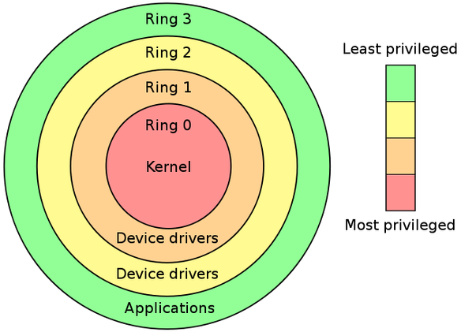
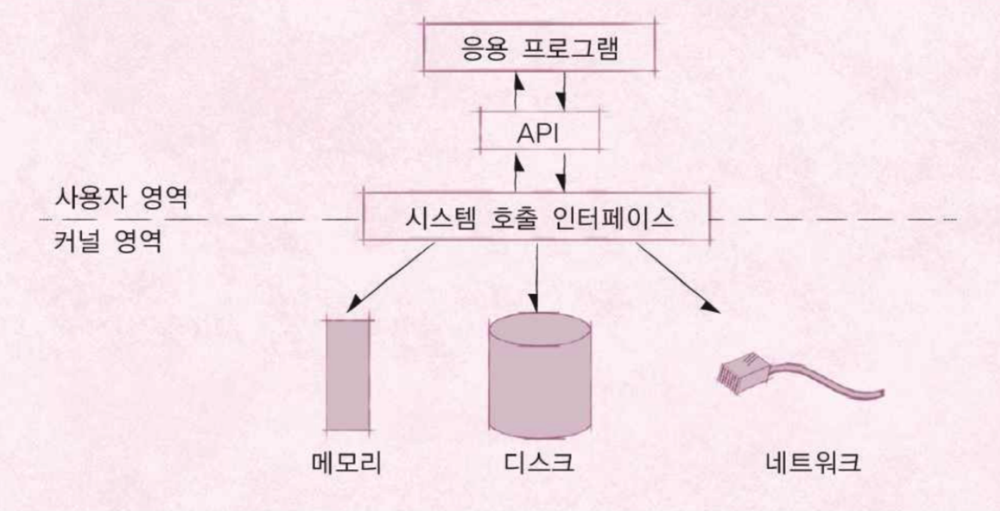
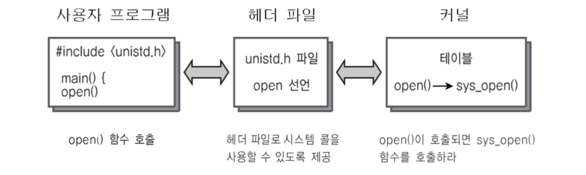

### 운영체제의 역할

> 컴퓨터의 하드웨어는 스스로 할 수 있는 일이 없다. 각 프로그램에 시스템 자원을 얼마나 할당해야하는지, 어떤 주소에 저장해야하며 어느 정도의 메모리 공간을 확보해야 하는지를 결정하는 것이 운영체제이다.

1. **시스템 자원을 관리**한다.
   - 음악을 들으면서 문서를 작성하는 경우를 생각해보자.
2. **사용자와 컴퓨터 사이의 커뮤니케이션 지원**한다.
   - 마우스가 화면에서 움직일 수 있는 것은 운영체제가 마우스와 모니터를 제어하고 있기 때문이다.
3. 컴퓨터 **하드웨어와 응용 프로그램을 제어**하고 관리한다.
   - 무한 루프를 도는 응용 프로그램이 있을 때, 운영체제는 이를 정지하거나 종료시키는 작업을 수행할 수 있다.

>운영체제의 목표 : 사용자가 사용하는 응용 프로그램이 효율적으로, 적절하게 동작하도록 지원

> 운영체제는 응용 프로그램이 요청하는 시스템 리소스를 효율적으로 분배하고, 지원하는 소프트웨어

# 운영체제 구조

> 사용자, 운영체제, 응용 프로그램, 컴퓨터 하드웨어의 관계와 구조를 이해하고, 응용 프로그램이 실행되는 컴퓨터 내부 모습을 설명할 수 있어야한다.

## I. 시스템콜

#### A. 운영체제, 응용 프로그램, 컴퓨터 하드웨어(시스템 리소스)의 관계

- 운영체제는 응용 프로그램이 요청하는 메모리를 허가하고, 분배한다. 
- 운영체제는 응용 프로그램이 요청하는 CPU 시간을 제공한다.
- 운영체제는 응용 프로그램이 요청하는 I/O 장치 사용을 허가/제어한다.

#### B. 사용자, 응용 프로그램, 컴퓨터 하드웨어의 관계

  

    User
  

  

  ↑ &nbsp;&nbsp;&nbsp; ↓
  

  

    Application
  

  

  ↑ &nbsp;&nbsp;&nbsp; ↓
  

  

    Operating System
  

  

  ↑ &nbsp;&nbsp;&nbsp; ↓
  

  

    Hardware
     
    (CPU, Memory, Storage, Network)
  

사용자가 응용 프로그램의 실행/사용하면, 응용 프로그램은 운영체제에게 필요한 시스템 자원을 요청한다. 운영체제는 요청에 맞춰 시스템 자원(하드웨어)를 할당/허가한다.

#### C. 운영체제는 사용자 인터페이스를 제공

  

    User
  

  

  ↑ &nbsp;&nbsp;&nbsp; ↓
  

  

    

      Application
    

    

      Shell
    

  

  

  ↑ &nbsp;&nbsp;&nbsp; ↓
  

  

    Operating System
  

  

  ↑ &nbsp;&nbsp;&nbsp; ↓
  

  

    Hardware
     
    (CPU, Memory, Storage, Network)
  

- 쉘(Shell)
  - 운영체제가 제공하는 사용자 인터페이스
  - 사용자가 운영체제 기능과 서비스를 조작할 수 있도록 인터페이스를 제공하는 프로그램
  - 쉘은 터미널 환경(CLI)과 GUI 환경 두 종류

#### D. 운영체제는 응용 프로그램을 위해서도 인터페이스를 제공

> 운영체제가 파일을 읽고 쓰는 API를 제공할 때, python의 sys.open()은 해당 API를 사용하도록 구현되어 있다.

- API (Application Programming Interface)

  

    

      User
    

    

    ↑ &nbsp;&nbsp;&nbsp; ↓
    

    

      

        Application
      

      

        Shell
      

    

    

    ↑ &nbsp;&nbsp;&nbsp; ↓
    

    

      API
    

    

    ↑ &nbsp;&nbsp;&nbsp; ↓
    

    

      Operating System
    

    

    ↑ &nbsp;&nbsp;&nbsp; ↓
    

    

      Hardware
       
      (CPU, Memory, Storage, Network)
    

  

  - 프로그래머는 프로그래밍 언어를 통해서 운영체제에 무언가를 요청할 수 있다.
  - 실제로는 언어마다 함수/라이브러리로 구현되어 있어 프로그래머가 편리하게 사용 가능
  - 각 프로그래밍 언어마다 운영체제 기능을 사용할 수 있는 함수/라이브러리를 제공한다.
    - ex) file read, write
  - 쉘도 하나의 응용 프로그램이다. 즉, 운영체제가 제공하는 시스템 API를 이용하여 구현되어 있다.
  - 마찬가지로 Application이 실행되고 있다는 것은 해당 프로그램 내부에서 시스템 API를 사용하고 있는 것이다.

- **시스템 콜** 👏 

  

    

      User
    

    

    ↑ &nbsp;&nbsp;&nbsp; ↓
    

    

      

        Application
      

      

        Shell
      

    

    

    ↑ &nbsp;&nbsp;&nbsp; ↓
    

    

      API or Library
    

    

    ↑ &nbsp;&nbsp;&nbsp; ↓
    

    

      System Call
    

    

    ↑ &nbsp;&nbsp;&nbsp; ↓
    

    

      Operating System
    

    

    ↑ &nbsp;&nbsp;&nbsp; ↓
    

    

      Hardware
       
      (CPU, Memory, Storage, Network)
    

  

  - 운영체제가 운영체제 각 기능을 사용할 수 있도록 시스템 콜이라는 명령 또는 함수를 제공
  - API 내부에서는 결국 시스템콜을 호출하는 형태로 만들어진다. 즉, 보통은 시스템 콜을 직접적으로 사용하기 보다 해당 시스템 콜을 사용해서 만든 언어별 라이브러리(API)를 사용한다.

#### E. 운영체제를 만드려면?

1. 운영체제를 개발한다.(kernel)
2. 시스템 콜을 개발한다.
3. 프로그램을 만들기 위해 각 언어별 API를 만든다.
4. 쉘 프로그램을 만든다.
5. 응용 프로그램을 만든다.

> API : 각 언어별 운영체제 기능 호출 인터페이스 함수

> 시스템콜 : 운영체제 기능을 호출하는 함수

## II. 사용자 모드와 커널 모드

#### A. CPU Protection Rings 👏 

CPU에는 권한 관령 중요한 두 가지 모드가 있다.

1. 사용자 모드(user mode)
  
   - *응용 프로그램이 사용*
   
- 어플리케이션 코드가 실행되는 곳
   - 코드를 작성하고, 프로세스를 실행하는 등의 행동을 하는 곳
   - **사용자가 접근할 수 있는 영역에 제한을 두어, 프로그램 자원에 함부로 침범하지 못하도록 함**
   
2. 커널 모드(kernel mode)

   - *OS가 사용*

   - **특권 명령어 실행과 자원 접근(메모리, CPU 등)을 가능케 하는 모드**
   - 제약 없이 모든 컴퓨터 자원을 제어 할 수 있다.
   - 운영체제가 CPU 등 시스템 자원을 사용할 때 사용하는 모드이다.

> 커널(Kernel) : 운영체제 본연의 기능과 핵심 소프트웨어를 말하며, 그냥 OS 자체를 커널이라고 생각해도 무방하다.

> 쉘(Shell) : 운영체제 즉, 커널의 껍데기

#### B. 응용 프로그램과 운영체제

> 우리가 실행하는 응용 프로그램은 어떤 기능은 사용자 모드에서, 어떤 기능은 커널 모드에서 수행된다.

[사용자 영역] 응용 프로그램이 실행되고 어떤 작업을 수행하기 위해 API를 통해서 시스템 콜을 호출한다.

[커널 영역] 시스템콜이 호출되면, 실제로는 해당 명령을 운영체제가 받아들이고 커널모드에서 작업이 수행되다.

> ***커널 모드에서만 실행 가능한 기능이 존재하며, 응용 프로그램이 이 기능을 이용하고 싶다면 반드시 시스템콜을 거쳐서 커널모드에 진입해야 한다. 사용자 모드와 커널 모드가 나눠지는 이유는 함부로 응용 프로그램이 컴퓨터 시스템을 헤치지 못하도록 하기 위함이다.***

#### C. Code example

#### D. 정리 👏 

- 운영체제는 `시스템 콜`을 제공한다.
- 프로그래밍 언어별로 운영체제 기능을 활용하기 위해, 시스템 콜을 기반으로 `API`를 제공한다.
- 응용 프로그램은 운영체제 기능 필요시, 해당 `API`를 사용해서 프로그램을 작성한다.
- 응용 프로그램이 실행되서, 운영체제 기능이 필요한 `API`를 호출하면, `시스템 콜`이 호출되서, `커널모드`로 변경되어 OS 내부에서 해당 명령이 실행되고, 다시 응용 프로그램으로 돌아간다.