# 프로세스와 스케쥴러

선점형, 비선점형 스케쥴링의 차이를 이해하고, 장단점을 설명할 수 있어야한다.

## I. 선점형과 비선점형 스케쥴러

> 스케쥴러가 CPU(프로세서)를 선점할 수 있는지에 따라 나눠진다.

### A. 비선점형 스케쥴러

현재 CPU에서 실행되고 있는 프로세스가 종료되거나 블록 상태가 되기 전에 다른 프로세스가 CPU에서 실행되지 못한다. 이는 스케쥴러가 CPU를 선점할 수 없기 때문이다.

즉, 하나의 프로세스가 끝나지 않으면 다른 프로세스는 CPU를 사용할 수 없다.

### B. 선점형 스케쥴러

시분할 시스템 환경에서 일정한 시간 뒤에, 현재 CPU에서 실행되고 있는 프로세스를 중지시키고 다른 프로세스를 실행 시킬 수 있다. 이는 스케쥴러가 CPU를 선점할 수 있기 때문이다. 

즉, 선점형 스케쥴러 환경에서는 하나의 프로세스가 다른 프로세스 대신에 CPU를 차지할 수 있다.

> 기본적으로 시분할 시스템에서는 선점형 스케쥴러 방식을 지원해야한다. 그래야 짧은 시간 단위로 쪼개서 다른 프로세스를 실행시킬 수 있다. 그러나 선점형 스케쥴러는 기존에 실행 중인 프로세스를 중단시키기 위해 고려할 사항이 많았고 구현이 어렵다.

### C. 선점형과 비선점형 스케쥴러의 차이 👏

(프로세스의 상태 정보를 기준으로 비교)

#### 1. 비선점형

- 프로세스가 자발적으로 blocking 상태로 돌아가거나, 실행이 끝났을 때만 다른 프로세스로 교체가 가능하다.

  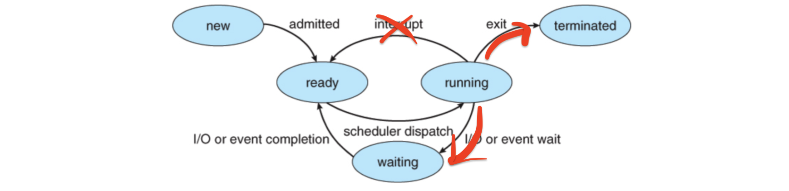

#### 2. 선점형

- 이미 실행되고 있는 프로세스를 스케쥴러가 중단시키고, 다른 프로세스로 교체가 가능하다. 즉, 새로운 프로세스 실행을 위해 실행중인 프로세스를 Ready 상태로 바꾸고, Ready 상태의 다른 프로세스를 Running 상태로 변경 시킬 수 있다.

  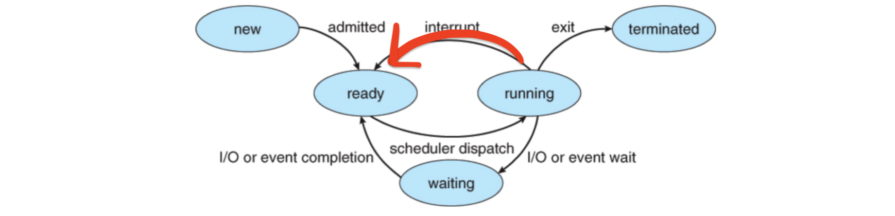

### D. 선점형과 비선점형 스케쥴링

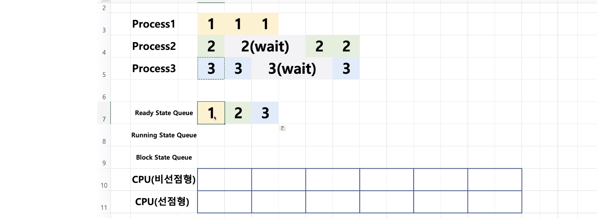

#### a. 비선점 스케쥴링

1. 프로세스1이 실행된 뒤, 프로세스1이 끝나거나 블록 상태(wait)이 발생하지 않으면 다른 프로세스가 실행 될 수 없으므로 쭉 실행된다.

   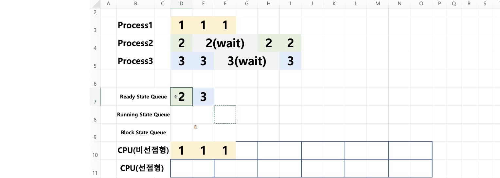

2. 프로세스1이 종료되면 다시 ready queue에서 프로세스2를 꺼내서 작업을 수행한다. 프로세스2는 1초뒤에 wait이 발생하므로 실행이 정지되고  block 상태가 된다.

   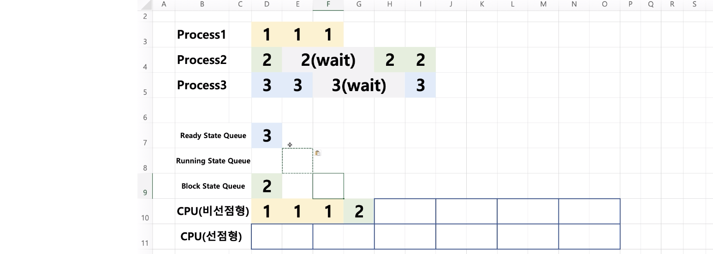

3. 프로세스3이 실행되고 block 상태가 될때까지 계속 실행된다. 2초 뒤, wait로 빠진다. 그런데, 이때 실행하는한 프로세스가 Ready queue에 존재하지 않으므로 idle 상태가 된다.

   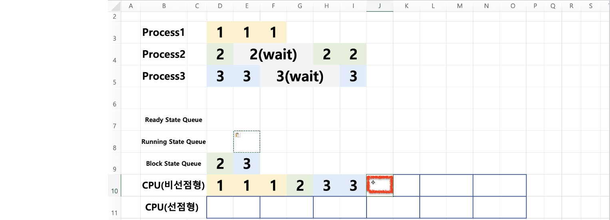

4. 프로세스2가 wait해야했던 3초가 지나서 프로세스2는 다시 Ready queue로 돌아간다. 이후, Ready queue에서 프로세스2가 빠져나오고 남은 2초동안 실행되고 종료된다. 또한, 프로세스3의 wait시간도 지났으므로 Ready 큐로 돌아온다.

   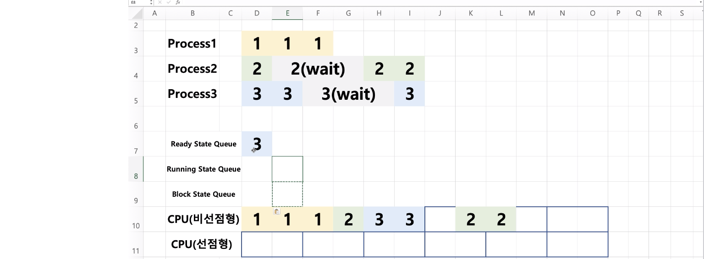

5. Ready 큐에 있던 프로세스3이 실행되고 종료된다.

   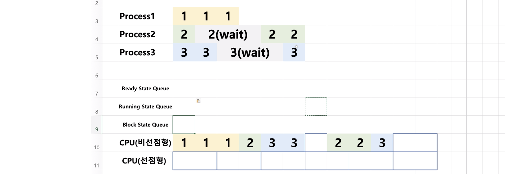

#### b. 선점 스케쥴링

선점형의 경우, 2초 단위로 스케쥴러의 CPU 선점이 진행된다고 가정한다.

1. Ready 큐에 있는 프로세스1이 실행된다.

   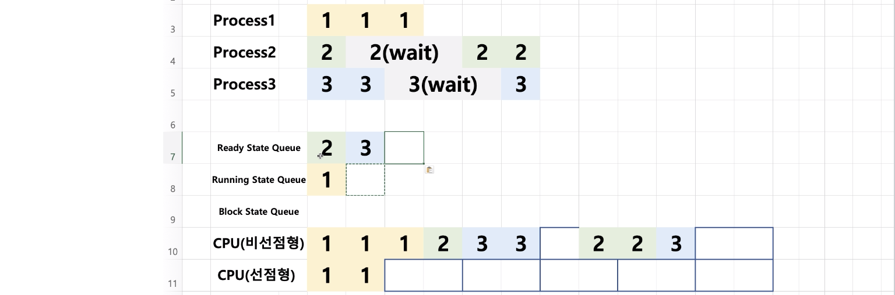

2. 2초 뒤, 스케쥴러가 프로세스1을 정지시키고 아직 작업이 남아있으므로 Ready 큐에 넣는다. 또한, Ready 큐에 있는 프로세스2를 꺼내서 실행시킨다.

   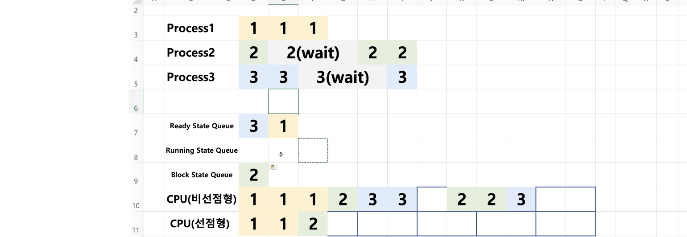
   
   - 프로세스2는 1초뒤에 wait이 일어나고 block 상태가 되고 스케쥴러는 CPU 선점이 가능하므로 Ready 큐에서 프로세스3을 꺼내고 바로 실행한다.
   
   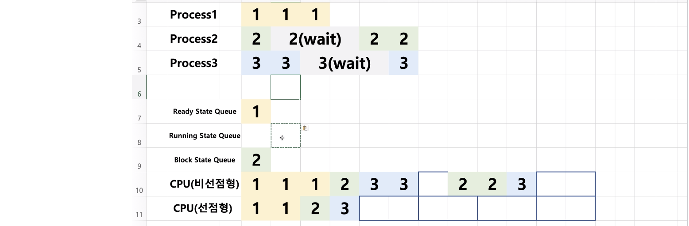
   
3. 3은 계속 수행될 것이 남아있지만 스케쥴러에 의해 Ready 큐로 이동하고 다시 프로세스1이 수행된다. 1은 1초뒤에 작업이 완료되어 종료된다.

   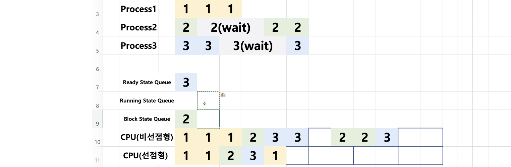

   - 1초 뒤에 프로세스가 종료되었으므로 스케쥴러가 CPU를 선점하여 Ready 큐에 있던 프로세스3을 다시 실행시킨다.

   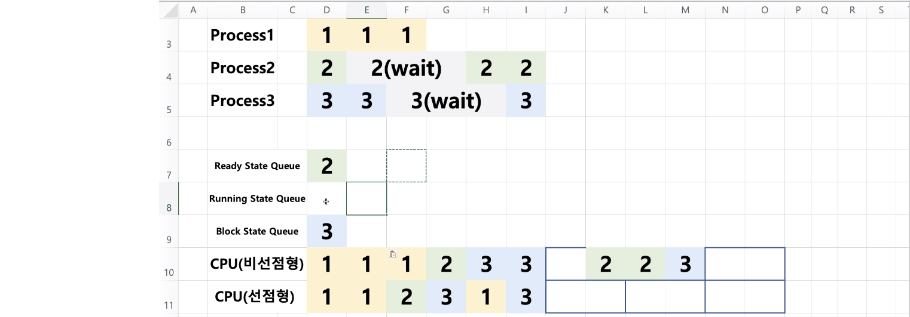

4. 프로세스3은 wait 상태가 되고, 프로세스2는 wait이 종료되어 Ready큐에 들어간다. 이후, 스케쥴러는 Ready 큐에 있는 프로세스2를 실행시킨다.

   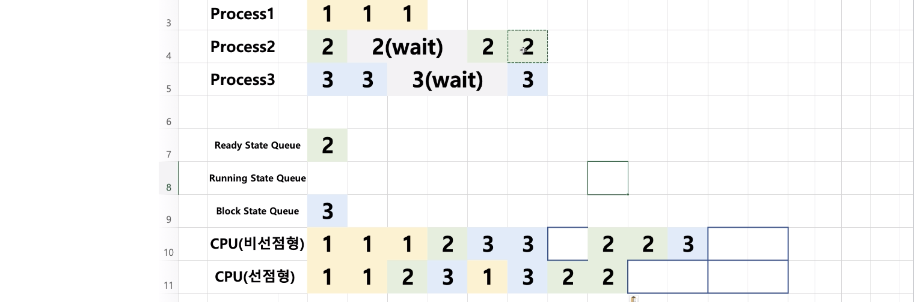
   
5. 2초뒤, 프로세스2는 완전히 종료되지만, 프로세스3은 아직 wait 상태이므로 실행되지 못하고 CPU는 idle 상태가 된다. 
  
  - 1초 뒤에는 프로세스3의 wait 상태가 끝나므로 Ready 큐로 돌아오고 1초 뒤에 프로세스3이 종료된다.
  
  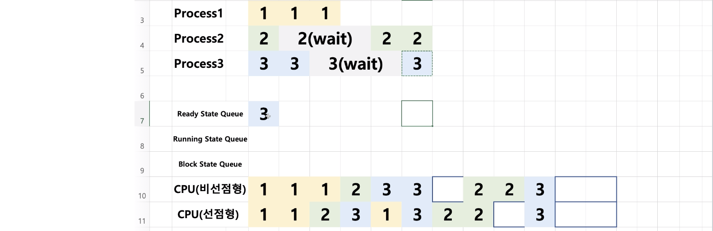

#### C. 비선점형 VS 선점형 스케쥴러

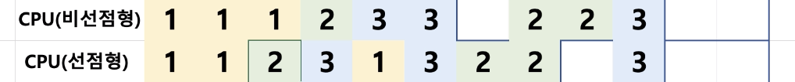

- 비선점형의 경우, 선행 프로세스1번의 수행 시간이 길때 나머지 프로세스의 대기 시간이 길어진다는 문제가 있다. 

- 반면, 선점형 프로세스는 프로세스 스케쥴링 시간이 길어도 다른 프로세스를 실행시키므로 프로그램의 응답시간이 줄어든다.

## II. 스케쥴링 알고리즘

어떤 프로세스를 먼저 실행시킬지에 대한 다양한 스케쥴링 알고리즘이 존재한다.

#### 스케쥴러 구분

- FIFO(FCFS), SJF, Priority-based 등 알고리즘은 어떤 프로세스를 먼저 실행시키고 끝내버릴지를 결정한다. 즉, 비선점형에 가깝다.
- RoundRobin은 시분할 시스템을 위한 기본 알고리즘으로 선점형 스케쥴러이다.

