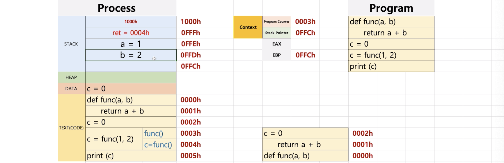
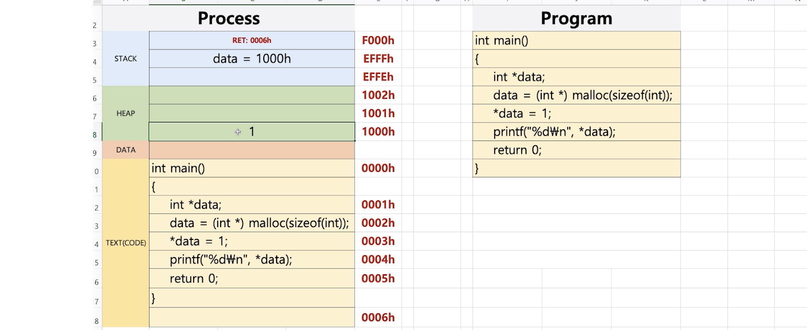

# 프로세스와 컨텍스트 스위칭

`컨텍스트 스위칭` : 스케쥴러가 실행 프로세스를 바꿔주는 과정

> 컨텍스트 스위칭을 이해하기 위해서는 프로세스 구조 및 실행파일의 구조를 이해해야한다.


## I. 프로세스 구조


- `code `
  - 컴파일된 소스 코드가 저장됨
- `data `
  - 선언된 변수가 저장되는 부분
  - 전체 코드가 컴파일되어 프로세스의 code 영역으로 올라갈때, data 영역에 변수의 공간을 생성한다.
- `stack`
  - 함수 안에서도 별도의 변수 지정이 가능하므로 함수는 동적으로 변수를 처리하기 위해 stack에 저장한다.
  - 함수는 여러번 어디에서나 사용이 가능하므로 함수가 호출되면 stack의 맨 위에는 return address가 저장되고, 함수 실행이 끝나면 해당 주소로 돌아가서 나머지 코드를 실행한다.
  - 위에서 아래로 쌓인다.
- `heap `
  - C언어에서 malloc()함수와 같이, 동적으로 특정 메모리 공간을 할당해야할 때 사용한다.
  - heap은 아래에서 위로 쌓인다.


#### 코드 실행과정을 프로세스 구조로 이해하기

**1) 소스코드 컴파일** 


- C언어는 main함수 안에서 실행되므로 전체 코드를 컴파일해도 함수 밖에서 정의된 변수가 없으므로 data 영역에는 아무것도 저장되지 않는다.


**2) main() 실행**


- code 영역을 한줄씩 읽는다.
- meaningless() : 함수 선언문이므로 아무일도 일어나지 않음

- main() 실행
  - 함수가 실행되려면 stack에 main() 함수가 끝난뒤에 실행될 return address를 넣어준다.
  - main()의 매게변수가 stack에 순차적으로 저장된다.
  - meaningless() 실행
  
  

**3) meaningless() 실행**


- stack에 meaningless() 함수가 끝난뒤에 실행될 return address를 넣어준다.
- meaningless()의 매게변수를 stack에 생성
- meaningless() 내부의 변수 temp를 stack에 생성


**4) meaningless() 종료**


- stack의 자료들을 순차적으로 pop하다가 return address를 만나면, code 영역의 해당 주소로 돌아가서 남은 code를 실행한다.


**5) main() 종료**


- return 문이 실행된 이후에 main()이 종료되고 순차적으로 stack 자료들이 pop 된다.


## II. 컴퓨터 구조 : 레지스터

> `PC`, `SP`가 프로세스 구조에서 어떤식으로 동작하는지 이해한다.

- `PC(Program Counter)` 
  - 주소 레지스터로 CPU가 **다음에 실행할 명령어의 주소**를 저장다.
  - `PC` 덕분에 프로그램 내부의 코드의 연속적인 실행이 가능하다.
- `SP(Stack Pointer)` 
  - 함수가 실행될 때 **스택의 제일 아래 주소를 가리키는 주소 레지스터로, 현재 진행중인 stack 지점을 의미**한다.
  - 스택 구조로 함수 및 interrupt의 호출/반환이 가능하게 한다.
- `EBP(Base Pointer)` 
  - 스택의 최상단 주소를 가리킨다. 즉, **스택의 가장 윗 부분**
  - 중첩으로 여러개의 함수를 실행시키거나 재귀를 돌릴때, 문제가 발생하면 어디서 문제가 발생하는지 알기 위해서 사용. 예외가 발생했을 때, 스택에서 가장 가까운 EBP를 꺼내면(해당 함수 호출이 시작된 스택 위치를 반환하므로) 어떤 함수에서 에러가 발생했는지 알 수 있다.
  
  
- `EAX` 
  
  - return이 일어날 때, **함수에서 반환될 값**이 저장됨


#### 코드 실행과정을 컴퓨터 구조로 이해하기

**1) 프로그램이 컴파일되었고 3번째 줄(c=0)까지 실행된 후의 모습**


**2) func() 실행**


1. EBP의 값을 스택에 삽입한다.
   - 초기 EBP 값은 SP의 값과 같다.
2. 함수의 return address를 삽입한다.
3. 함수의 매게변수 생성
4. 함수의 지역변수 생성
5. SP값 변경(최상단 stack 저장)

> 만약 func() 안에서 다른 함수를 호출한다면, EBP의 값은 현재 SP로 변경된다. 즉, 현재 실행하고 있는 함수의 시작점이 EBP에 저장된다. 그래서 문제가 발생하면 EBP를 확인하여 어느 지점에서 문제가 발생했는지를 찾을 수 있게 된다.
>
> 


**3) return : 함수 종료**


1. return이 발생하면 EAX에 반환값이 저장된다.
2. 이후, stack에 저장된 값을 return address와 EBP값을 만날 때까지 빼내고 종료시킨다.


**4) 함수의 리턴값 할당**


1. c = func() : EAX에 저장된 func()의 return값이 C에 할당된다.

2. 0004h부분이 끝났으므로 PC값이 1 증가한다.

   

3. PC가 가리키는 print(c) 실행


### A. 프로세스 구조와 힙

```c
int main(){
  int *data;	// main함수의 지역변수이므로 stack에 생성
  data = (int*) malloc(sizeof((int));	// heap에 int 크기의 공간이 할당되고, 해당 주소를 data에 저장한다.
  *data = 1; // data가 가리키는 메모리 공간에 1을 저장
  printf("%d\n", *data);
  return 0;
}
```




### B. 프로세스 구조와 스택

> DATA 영역은 사실  `BSS`와`DATA` 두 부분으로 나눠진다.

`BSS` : 초기화되지 않은 전역변수

`DATA` : 초기화가 이미 진행된 전역변수


#### 스택오버플로우

- 프로세스 구조를 이용한 해킹 기법
- 스택에서 오버플로우를 일으켜, return address를 바꿔치기하여 원하는 코드가 실행되도록 만든다.


**[정상적인 실행]** 프로그램을 실행시킬때 매게변수로 "aaaaaa"


**[스택오버플로우]** 프로그램을 실행시킬때 매게변수로 "aaaaaacc"


- 마지막 c는 해당 함수가 종료 되고 실행될 다음 코드를 의미하는데, 이부분을 조작하면 해커가 심어둔 악성코드를 실행시킬 수 있다.


