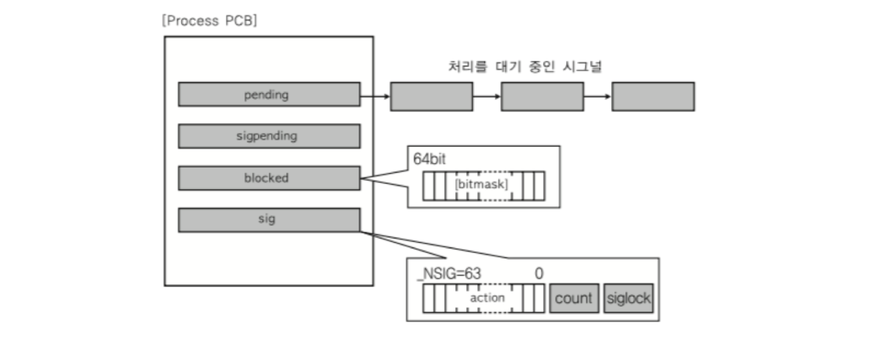
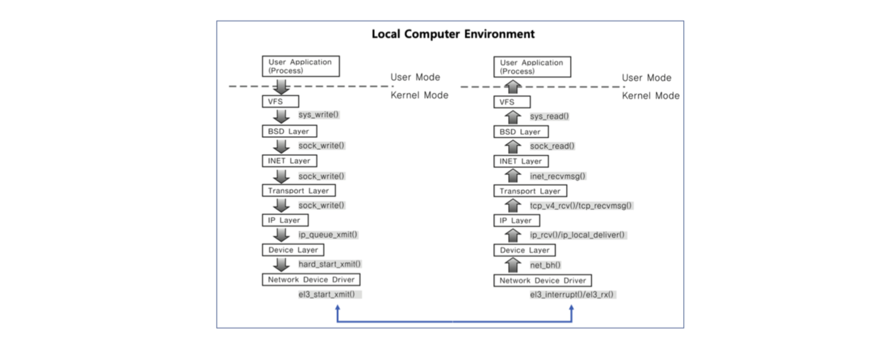

# 프로세스와 IPC

> IPC가 필요한 이유를 프로세스의 구조로 이해한다.


### A. 프로세스 공간

운영체제의 실제 프로세스간 공간은 완전히 분리되어 있다. **사용자 모드에서 커널 공간엔 접근할 수 없다.**


- 하나의 프로세스의 크기가 4Gb로 정해져 있을 때, 내 컴퓨터의 메모리는 16Gb이다. 그렇다면 어떻게 동시에 여러 개(4개 이상)의 프로그램을 돌릴 수 있는 것일까? 가상 주소를 사용하기 때문에 가능하다. 실제 물리 메모리에 있는 공간과 다른 가상 주소를 사용하는데, 이는 가상 메모리 강의에서 배움

- 어떤 프로세스든 지정할 수 있는 주소는 0번부터 4Gb까지라는 점과 3Gb~4Gb에는 운영체제 코드가 0 ~ 3Gb에는 실제 프로그래머가 작성한 프로그램들이 사용하는 영역이다.


주소 공간을 모두 사용하는 것이 아니라, 일부분만 사용한다. 그 중 아주 작은 부분만 실제 물리 메모리에 올라가므로 여러 개의 프로그램을 돌리는데 문제가 되지 않는다.

그렇다면 여러 개의 프로그램을 돌릴 때, 각 프로세스마다 운영체제 코드가 따로 존재한다면 공간의 낭비이다. 그래서 각 프로세스의 커널 부분은(운영체제 코드) 실제 물리 메모리에 올라갈 때, 동일한 공간을 공유한다. 즉, **프로세스들은 커널 공간을 공유한다.**


### B. IPC : InterProcess Communication

다양한 IPC 기법(프로세스간 커뮤니케이션)이 존재한다.

1. file 사용 : 실시간성 떨어짐, 저장매체를 다녀오는 것이므 시간이 오래걸림
2. Message Queue
3. Shared Memory
4. Pipe
5. Signal
6. Semaphore
7. Socket

> 2번 ~ 8번 기법은 모두 커널공간(이미 물리 메모리에 올라와 있는 것)을 이용하는 것이므로, 저장매체인 file을 엑세스하는 것보다 빠르며 프로세스 간 공유가 가능하다는 장점이 있다. 즉, **IPC는 커널 공간을 어떻게 활용할 것인가**가 핵심이다.


**[정리] IPC가 필요한 이유** 🔥

1. 여러 프로세스를 동시에 실행할 때, 병렬처리를 해야 속도가 빨라진다. 그러나 병렬처리를 하더라도 프로세스간 통신이 필요한 부분들이 있다. 그렇다고 프로세스A가 프로세스B의 코드나 데이터에 직접 접근할 수 있다면 큰 문제가 생길수 있으므 별도의 커뮤니케이션 방법을 제공해야 한다.
2. 프로세스 공간은 완전히 분리되어 있다. 해커들이 만든 프로그램이 강제로 다른 프로그램에 접근하는 것을 막기 위해 최대한 분리해둠
3. 즉, 프로세스간 통신을 위한 특별한 기법이 필요하다. 이것이 IPC 기법이다.
4. 대부분 IPC 기법의 핵심은 커널 공간을 활용하는 것이다. 프로세스간 커널 공간은 공유하기 때문이다.


## I. 다양한 IPC 기법

> 각 IPC 기법의 장단점을 간단히 이해하고 넘어가기


### 1. 파이프(Pipe)


- 기본 파이프는 단반향 통신, 부모의 값을 자식에게 전달

- fork()라는 시스템콜로 자식 프로세스를 만들 때, 부모와 자식간의 통신이 가능

  > **fork**는 시스템콜 중에 하나로, 현재 실행중인 프로세스의 코드를 복사하여 새로운 프로세스를 생성하고 PC가 바로 다음 위치를 가리키게 한다. 이때, 원본을 부모 프로세스, 복사본은 자식 프로세스라고 한다.

  > 그렇다면, 왜 같은 코드와 데이터를 가지는 프로세스를 하나 더 생성하는 가? 하나의 프로세스에서 동시에 두 가지 작업을 수행해야할 때, Pid를 조건문으로 분기시켜 사용한다. (자식 프로세스의 pid는 0으로 생성된다.)

```c
char* msg = "Hello Child Process!"; 
int main()
{
  char buf[255];
  int fd[2], pid, nbytes;
  if (pipe(fd) < 0)
		exit(1);
	pid = fork();	// fork() 함수를 사용하면 부모/자식 프로세스로 나눠짐
  if(pid>0){	// 부모 프로세스에는 실제 PID가 들어감
    pid write(fd[1], msg, MSGSIZE);	// write시스템 콜을 이용해 msg를 쓴다.
    exit(0);
  }
	else{ //	pid 0 : 자식 프로세스의 PID는 0이다.
		nbytes = read(fd[0], buf, MSGSIZE); // buf에는 부모 프로세스의 msg가 넘어온다!
    printf("%d %s\n", nbytes, buf);
		exit(0);
	}
	return 0; 
}
```


### 2. 메시지 큐(Message Queue)


- FIFO 정책으로 프로세스A에서 프로세스B로 데이터를 전송
- 메시지 큐는 부모/자식이 아니라, 어느 프로세스간에도 데이터 송수신이 가능하다.

```c
// 프로세스A
msqid=msgget(key, msgflg)	// key = 1234
msgsnd(msqid, &sbuf, buf_length, IPC_NOWAIT)	// 데이터가 메시지큐에 들어감
```

```c
// 프로세스B
msqid = msgget(key, msgflg)	// key값을 동일하게 1234로 해야 해당 큐의 id를 얻을 수 있다.
msgrcv(msqid, &rbuf, MSGSZ, 1, 0)	// 해당 메시지큐의 데이터를 하나씩 꺼낸다.
```


>**파이프와 메시지 큐**
>
>
>
>- 파이프와 메시지 큐 모두 커널 공간의 메모리를 사용한다.


### 3. 공유 메모리(Shared Memory)


- 노골적으로 커널 공간에 메모리 공간을 만들고 해당 공간을 변수처럼 사용하는 방식
- 공유 메모리 key를 가지고 여러 프로세스가 접근이 가능하다.

```c
// [1] 공유 메모리 생성 및 공유 메모리 주소 얻기
shmid = shmget((key_t)1234, SIZE, IPC_CREAT|0666))
shmaddr = shmat(shmid, (void *)0, 0)

// [2] 공유 메모리에 쓰기
strcpy((char *)shmaddr, "Linux Programming")
  
// [3] 공유 메모리 읽기
printf("%s\n", (char *)shmaddr)
```


> 시그널, 소켓 - IPC를 위해 나온 기술은 아니지만, IPC로 사용할 수 있다.

### 4. 시그널(Signal)

- 유닉스에서 30년 이상 사용된 전통적인 방법
- 커널에서 프로세스에게 다른 프로세스에 어떤 이벤트가 발생되었는지 알려주는 기법으로, 이 방법을 사용하면 당연히 프로세스 간 통신이 가능하다.
- 시그널은 미리 정의된 일종의 이벤트로, 각각의 시그널이 발생했을 때 수행할 동작을 운영체제 단에서 이미 구현되어 있다. 약 64개 정도의 명령어가 존재함
  - SIGKILL : 프로세스를 죽임
  - SIGALARM : 알림을 발생한다.
  - SIGSTOP : 프로세스를 멈취라
- 프로그램 코드에서 관련 시그널을 등록해서, 해당 시그널 처리를 실행한다.
  - 시그널 무시
  - 시그널 블록(블록을 푸는 순간 프로세스에 해당 시그널 전달)
  - 등록된 시그널 핸들러로 특정 동작 수행
  - 등록된 시그널 핸들러가 없다면, 커널에서 기본 동작 수행
- PCB에서 해당 프로세스가 처리해야하는 시그널 관련 정보를 관리한다.
  - sigpending : 받은 시그널이 있는지를 알려줌
  - pending : 어떤 시그널부터 처리 대기 중인지 알려줌
  - blocked : 블록된 시그널이 뭔지 알려줌
  - sig : 각각의 시그널이 어떤 동작을 수행할지 아니면 특별한 핸들러가 등록되어 있는지 알려줌
  
  

- 사용자 모드 => 커널 모드 (=> 이때!) 사용자 모드 + 프로세스의 PCB를 보고 처리가 필요한 시그널이 있다면, 해당 signal을 담당하는 커널함수를 호출하고 실행한 뒤 사용자 모드로 전환된다. **즉, 커널모드에서 사용자모드로 전환되는 시점에서 signal을 처리한다.**


### 5. 소켓(Socket)

- 소켓은 네트워크 통신을 위한 기술

- 기본적으로는 클라이언트와 서버 등 두 개의 다른 컴퓨터 간의 네트워크 기반 통신을 위한 기술

- IPC 기법에서 소켓은 하나의 컴퓨터 내에서 두 개의 프로세스간 통신 기법으로 사용될 수 있다.

  


## II. 프로세스 정리 및 성능 개선 방법의 이해🔥

> 실제 코드를 기반으로 프로세스의 내부 동작 과정을 설명해보고, 더 나아가 성능 개선을 생각해본다.


| 프로세스 구조 |                                                              |
| ------------- | ------------------------------------------------------------ |
| STACK         |                                                              |
| HEAP          |                                                              |
| BSS           |                                                              |
| DATA          |                                                              |
| CODE          | 위의 코드에는 전역 변수가 존재하지 않으므로, CODE 영역에만 값(프로그램 코드)이 존재함 |


**선점형 스케쥴러를 사용하여 0.05초마다 러닝 프로세스를 바꿔준다고 가정해본다.**

- 하드웨어로 부터 일정 시간마다 타이머 인터럽트를 발생시켜 운영체제에게 이를 알려야한다.

```
// 0.01초마다 인터럽트를 발생시킴
get_counter(){	
	counter++
	if(counter > 4)
		context_switching()	// 0.05초 이후에 현재 ready상태인 프로세스를 running으로 바꾸는 작업을 수행
}
```

1. 해당 프로세스가 running이 되면서 Stack 영역에  main함수와 지역변수 fd가 생성된다.
2. open()의 경우 시스템 콜이므로 인터럽트를 일으킨다.
   1. CPU가 저장매체에서 해당 파일을 연다. 저장매체에 어떤 작업을 하는 것은 시간이 오래 걸리는 일이므로 해당 프로세스는 running에서 waiting으로 넘어간다.
   2. 해당 파일을 읽는 것이 끝나면 인터럽트가 발생한다. waiting에 있는 프로세스를 ready로 변경하고 다시 running으로 변경한다.
3. 나머지 코드를 수행한 뒤, 종료된다.

> 하나의 프로세스가 실행되는 동안 많은 인터럽트 처리가 존재한다. 이때, IO를 사용하는 경우, 인터럽트, 스케쥴러, 시스템콜, 하드웨어 등의 조작이 필요하다. 즉, **프로그램을 만들 때에는 IO 처리는 최소화 하는 것이 좋다**.(spark는 모든 데이터를 메모리에 올린 뒤에 실행하므로 데이터처리할 때 빠르다.)


