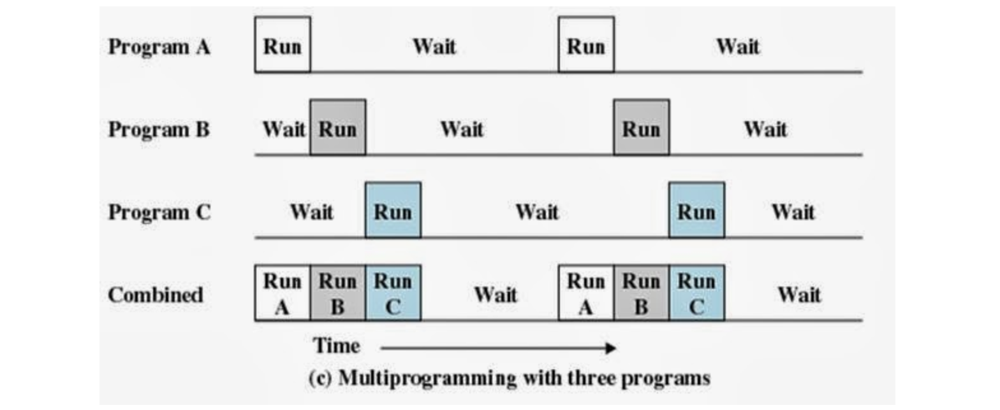

# 스케쥴링 알고리즘

프로세스 상태와 스케쥴링 알고리즘의 관계를 이해한다.

>#### 멀티 프로그래밍과 Wait 란?
>
>- **멀티 프로그래밍 : CPU 활용도를 극대화 하는 스케쥴링 알고리즘**
>- Wait : 저장매체로부터 파일이 CPU에 올라와 실행되기까지 걸리는 시간
>
>
>
>최적의 스케쥴링 순서를 생각해보면, 위의 그림처럼 A, B, C 순서로 프로세스가 수행되어야 한다. 그렇다면, 멀티 프로그래밍 환경에서 어떤 스케쥴링 알고리즘을 사용해야 CPU의 활용도을 극대화 할 수 있을까?

## I. 프로세스 상태 👏 

> 스케쥴링 알고리즘은 어떤 시점에 어떤 프로세스를 실행시킬지를 판단하는 것이며, 이때 프로세스의 상태 정보를 이용하여 결정한다. 그래서 프로세스의 상태 정보를 스케쥴러가 필요로 한다.

- new state : 프로세스가 CPU에 생성 중인 상태, 모두 CPU에 올라가면 ready state가 됨

- ready state(실행 가능) : 지금 CPU에서 해당 프로세스를 바로 실행할 수 있는 상태(실행 대기 상태)
- blocking state(대기) : 저장매체에서 파일읽기를 대기하는 상태, 특정 이벤트 발생 대기 상태
  - 어떤 프로세스가 파일 읽기를 요청했다면 해당 프로세스는 파일 읽기가 끝날 때까지 대기상태가 된다. 파일 읽기가 끝난 뒤, 운영체제에서 특정 이벤트를 발생시켜 프로세스에게 파일 읽기가 끝났음을 알린다.
- running state : 현재 CPU에서 실행하고 있는 상태
  - single core 환경에서 running state를 가진 프로세스는 당연히 1개 이하이다.
- exit state(종료) : 프로세스가 종료되기 위해 프로세스가 가지고 있었던 시스템 자원을 풀어주는 상태

#### 프로세스 상태간 관계

1. Process blocks for input 

   - 특정 이벤트 대기 상태

   - 현재 프로세스가`running state` 인데, 파일 읽기를 요청했다. 그러면 그 다음 줄부터는 파일을 읽어오기 전까지 실행을 못하는 상태가 되는데, 이때 프로세스의 상태가 `block state`로 바뀐다.

4. Process becomes available 

- `block state`에서 요청된 작업이 모두 완료되면, 스케쥴러한테 해당 프로세스를 running state로 바꿔도 좋다고 알리기 위해 `ready state`로 바꾼다.
- 어떤 프로세스가 ready state가 되면, 스케쥴러가 CPU에서 수행해야될 다음 작업(프로세스) 리스트로 인식할 수 있게 된다. 

2. Scheduler picks another process
   - `ready state`에 있는 프로세스 중, CPU에서 수행할 다음 작업으로 스케쥴러가 특정 프로세스를 선정하면, 해당 프로세스는 `running state`가 되고 CPU에서 작업이 수행된다.

3. Scheduler picks this process 
   - 시분할 시스템에서 특정 시점마다 다른 프로세스로 교체가 진행되게 되는데, 어떤 프로세스가 특정 시간동안의 선점(`running state`)이 종료되고 다음 시점을 기다리는 상태(`ready state`)로 바뀌는 상태

> 여러개의 ready state의 프로세스 목록이 존재할 때, 다음 작업으로 어떤 프로세스를 선정해야 효율이 좋을지 는 알 수 없다. 그래서 프로세스 상태 정보 외에도 스케쥴링을 위한 다른 정보가 필요하다. 
>
> [문제] ready state인 프로세스가 총 3개 있을 때, 어떤 걸 먼저 실행해야 하는가?
> 

## II. 프로세스 상태기반 스케쥴링 알고리즘

> 각 상태별 큐를 생성하여 선입선출 구조로 스케쥴링을 구성하는 방법

#### 시분할 시스템을 가정했을 때, 프로세스 상태기반 스케쥴링 알고리즘

**[t = 0]**

- CPU가 비어있을 때, 스케쥴러는 그냥 Ready state queue에서 맨 앞에 있는 프로세스1을 실행시키고 Running state queue에 넣어주면 된다.

**[t = 1]**

- 일정 시간이 지난 뒤, 실행중이던 프로세스를 정지하고 다음 작업이 남아있는 프로세스라면 Running state queue에서 Ready state queue로 돌려보낸다.

- 1과 동일하게 Ready state queue에서 맨 앞의 프로세스2를 실행시키고 Running state queue에 넣어준다.

**[t = 2]**

- 프로세스2는 한번 실행되고 나면 wait 상태가 되므로 Running이 아닌 Block 상태가 되며, Block state queue에 저장된다.
  - 3초 뒤에 다시 Ready state queue로 저장(t = 5)

- Ready state queue에서 맨 앞의 프로세스3을 실행시키고 Running state queue에 넣어준다.

**[t = 3]**

- 프로세스3을 정지시키고 작업할 양이 남아 있음으로 Ready state queue에 다시 넣어준다.

- Ready state queue에서 맨 앞의 프로세스1을 실행시키고 Running state queue에 넣어준다.

**[t = 4]**

- 프로세스1은 남은 작업이 없으므로 Ready state queue에 넣지 않는다.

- Ready state queue에서 맨 앞의 프로세스3을 실행시키고 Running state queue에 넣어준다.

**[t = 5]**

- wait 시간이 종료된 프로세스2가 Block state queue에서 Ready state queue에 저장된다.

-  프로세스3는 2초간 실행되고 나면 wait 상태가 되므로 Running이 아닌 Block 상태가 되며, Block state queue에 저장된다.
  - 3초 뒤에 다시 Ready state queue로 저장(t = 8)
- Ready state queue에서 맨 앞의 프로세스2을 실행시키고 Running state queue에 넣어준다.

**[t = 6]**

- 아직 1초밖에 안 지났으므로 프로세스3은 계속 Block 상태
- 프로세스2는 남은 작업이 없으므로 Ready state queue에 넣지 않고 종료된다.

> 이렇게 CPU가 비어있는 상태, 아무 작업도 수행하지 않는 상태를 `idle` 이라고 한다.

**[t = 7]**

**[t = 8]**

- wait 시간이 종료된 프로세스3이 Block state queue에서 Ready state queue에 저장되고, 다시 Ready state queue에서 Running state queue로 옮겨가고 프로세스3이 실행된다.

- 프로세스3은 남은 작업이 없으므로 Ready state queue에 넣지 않고 종료된다.

> 프로세스 상태를 기반으로 큐를 만들어 스케쥴링 하는 것외에도 다양한 스케쥴링 기법(우선순위, 최단시간 등)이 존재한다.