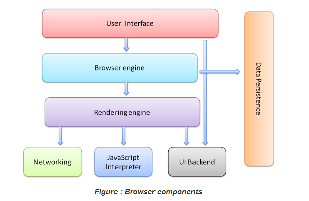
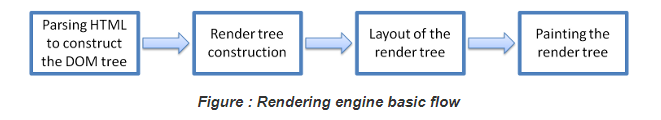
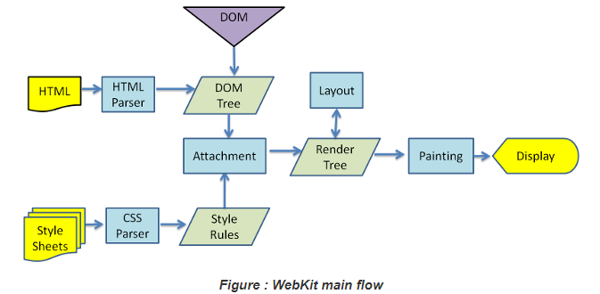
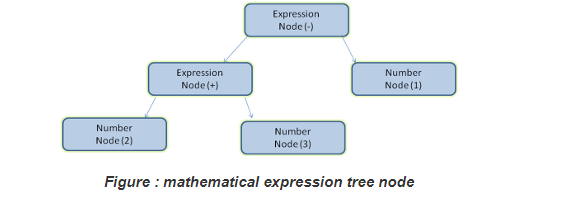

# Browser

*2019.05.28*

[how borwsers work](https://www.html5rocks.com/en/tutorials/internals/howbrowserswork/)

## 1. Browser의 동작

웹을 통해서 전달되는 데이터는 어딘가에서 해석되어야 한다.

서버에서 전송한 데이터가 도착하는 곳은 `Browser`이다. 때문에 브라우저에는 데이터를 해석해주는 `파서`와 데이터를 화면에 표현해주는 `렌더링엔진`이 포함되어 있다.

### 1.1. Browser는 어떻게 동작할까?

브라우저의 동작방식을 이해하게 된다면 보다 최적화된 웹 개발을 할 수 있을 것이다.

- User Interface 
  - 브라우저를 사용하는 사용자 화면에 보이는 모든 구성
  - 예) 네비게이션, 창닫기 버튼 등
- Browser engine
  - UI와 rendering engine 사이의 정렬을 진행한다.
  - html 소스코드를 해석해 사용자가 볼 수 있게 실행해주는 것
  - 화면에 직접 어떤 위치에 어떤 색을 칠할지. 즉, 브라우저 소프트웨어를 동작시켜주는 핵심 엔진
- Data Persistence
  - 브라우저가 하는 데이터 캐시 및 저장 역할. 즉, 데이터 관리
- **Rendering engine**
  - 요청 된 콘텐츠를 표시합니다. 
  - 예를 들어 요청한 컨텐트가 HTML 인 경우 렌더링 엔진은 HTML과 CSS를 구문 분석하고 파싱 된 내용을 화면에 표시합니다.
- Networking module
  - 서버와 통신, HTTP를 통해서 서버(특정 인터넷 주소를 해석)와 통신하는 부분
- Javascript Interpreter
  - 자바스크립트 코드를 해석하는 부분
- UI backend
  - UI  영역을 처리할 수 있는 백엔드 영역

#### (1) Rendering engine의  basic flow

`Rendering engine`은 브라우저별로 종류가 다르다.

**[1] HTML 파싱하여 DOM Tree 만들기**

- html 문서 구조를 파싱하여 html 태그 정보들을 일종의 트리형태(DOM Tree)로 데이터를 가지고 있게 된다.

**[2] 렌더 트리 만들기**

**[3] 렌더트리 + CSS 로 레이아웃 결정하기, 배치**

- 스타일 정보와 구조를 합쳐서 매핑한다.
- 화면에 어떤식으로 배치할지를 결정. 즉, 첫번째 div태그는 왼쪽 위에 그리기같은 것을 결정한다. 

**[4] 렌더트리 그리기**

- [3]에서 렌더 정보를 결정한 후,  화면에 직접 그림을 그리게 된다.

#### (2). HTML Parser & CSS Parser

HTML을 해석해서 DOM Tree를 만들고 CSS를 해석하여 역시 CSS Tree를 만든다. 이 과정에서`HTML Parser`와 `CSS Parser`가 쓰인다. DOM Tree와 CSS Tree는 연관되어 있으므로 `Render Tree`로 재조합 되고 이를 바탕으로 화면에 `Painting`하게 된다.

> **[ Parsing general ]**
>
> 
>
> 만약 2+3-1을 처리한다고 가정했을때 `parsing`이란 2,+,3,-,1를 토큰으로 분리하여 각 값이 가지고 있는 의미를 해석하고, 신택스 트리를 만드는 것이다. 이후  `parsing`을 통해 만들어진 신텍스 트리 정보를 따라 어떤 값의 처리가 일어나게 된다.
>
> 파싱이란, 일종의 컴파일러로 토큰 단위로 값을 잘라 의미에 따라 어떤 실행을 해주는 것을 말한다.

