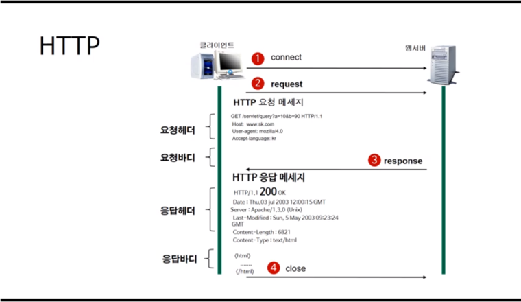

# HTTP

*2019.05.28*

## 1. 웹의 동작(HTTP 프로토콜의 이해)

웹 브라우저와 웹 서버 간에 서로 통신하기 위한 규약

### 1.1. HTTP(Hyper Transfer Protocol)

> 인터넷이란?
>
> - 인터넷 != WWW
>
>   인터넷을 World Wide Web으로 생각할 수 있지만 이는 부분적인 것이다. 물리적인 하나의 컴퓨터에는 여러 개의 서버가 동작할 수 있으며, 각각의 서버는 포트 값으로 구분되어 동작한다. (예) WEB: 80, FTP : 21) 즉, 웹(www)이란 인터넷 속에서 80번 포트를 이용해 동작하는 것으로 인터넷의 부분으로 생각할 수 있다.  
>
> - 인터넷 = TCP/IP 기반의 네트워크가 전세계적으로 확대되어 하나로 연결된 네트워크의 네트워크를 말한다. (네트워크의 결합체)

인터넷 중 웹에서는 서로 통신하기 위해서 HTTP를 사용한다.

서버와 클라이언트가 인터넷상에서 데이터를 주고 받기 위한 프로토콜이며, 어떤 종류의 데이터도 주고 받을 수 있도록 설계되었다.(이미지가 포함된 문서와 브라우저를 통해 동영상을 볼 수 있는 것은 이 때문이다.)

#### (1) HTTP 작동방식

- HTTP는 서버/클라이언트 모델을 따른다.

- 클라이언트가 `요청(request)`을 서버에 보내면, 서버는 클라이언트에게 `응답(response)`을 보낸다.

**[ 장점 ]**

불특정 다수를 대상으로 하는 서비스에 적합하다. 클라이언트와 서버가 계속 연결된 형태가 아니므로 클라이언트와 서버간의 최대 연결 수보다 훨씬 많은 요청과 응답을 처리할 수 있다. 이러한 특징이 있어 HTTP를 `무상태(stateless) 프로토콜`이라고 한다.

**[ 단점 ]**

**`무상태(stateless) 프로토콜`**의 특징으로 클라이언트와 계속해서 연결하는 것이 아닌 ***연결이 끊긴 상태를 유지하므로, 클라이언트의 전 상황을 알 수가 없다.*** 이러한 특징 때문에 클라이언트와 연결이 끊긴 후 다시 연결하더라도 이 전의 상태를 유지하기 위해 `쿠키(Cookie)`와 같은 기술이 등장했다.

### 1.2 URL(Uniform Resource Locator)

인터넷 상의 자원의 위치를 말한다.

- 자원이 있는 물리적인 컴퓨터를 찾기위해 필요한 값 :  IP 혹은 도메인
- 물리 컴퓨터 내부의 소프트웨어 서버를 찾기 위해 필요한 값 : 포트

> - ip: 집 주소, port : 방의 위치로  생각하면 쉽다. (단, 하나의 방에 한 개의 서버만 존재한다.)
> - 하나의 물리적인 컴퓨터에는 여러 개의 소프트웨어 서버가 동작할 수 있는데, 이 서버는 포트값이 다를게 동작되야 한다.

### 1.3 HTTP의 동작

(1), (2) : 반드시 클라이언트가 이 서버에 접속해서 `요청(request)`을 보낸다.

> **[ Request ]**
>
> 요청은 크게 `헤더`, `빈줄`, `바디` 3가지 부분으로 나뉜다.
>
> - 헤더 
>   - **요청 메서드**(GET, POST,PUT,DELETE) + **요청 URI**(요청하는 자원의 위치) + **HTTP 버전**(웹 브라우저가 사용하는 프로토콜의 버전)
>   - 헤더 정보( 헤더명 : 헤더값 )
> - 바디 
>   - 요청 메서드가 POST, PUT인 경우에만 바디값이 들어온다.

(3) : 이때 서버는 이 요청에 따른 `응답(response)`을 클라이언트에게 보낸다.

> **[ Response ]**
>
> 응답 역시, 크게 `헤더`, `빈줄`, `바디` 3가지 부분으로 나뉜다.
>
> - 헤더
>   - **HTTP 프로토콜의 버전** + **응답코드** + **응답 메시지**
>   - 날짜, 웹 서버 이름과 버전, 콘텐츠 타입, 캐시 제어 방식, 콘텐츠 길이 등
> - 바디
>   - 실제 응답 **리소스**

(4) : 응답을 성공적으로 보내고 난 뒤 서버와 클라이언트의 연결이 끊긴다.(stateless)

## 2. HTTPS(HyperText Transfer Protocol Secure)

HTTP와 유사하지만 모든 통신 내용을 암호화하는 것이다.

HTTPS는 인터넷 상에서 정보를 암호화하는 SSL 프로토콜을 이용하여 클라이언트와 서버가 데이터를 주고 받는 (공개키 기반)통신규약이다. 

